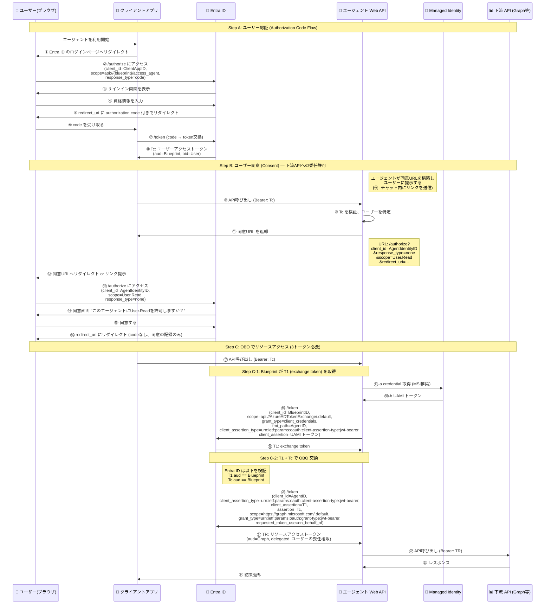
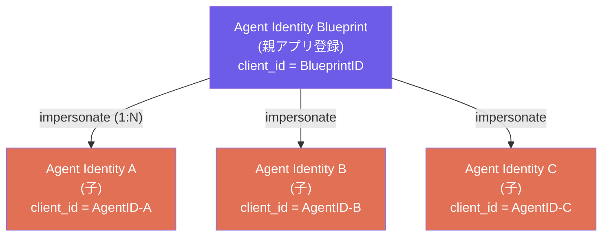
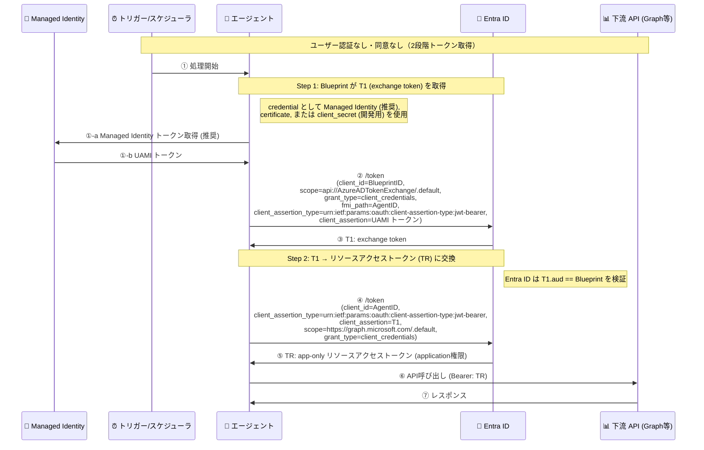
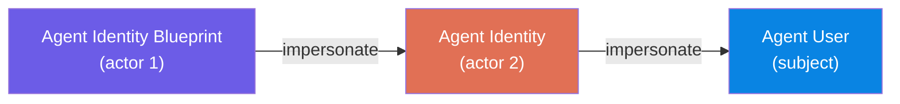
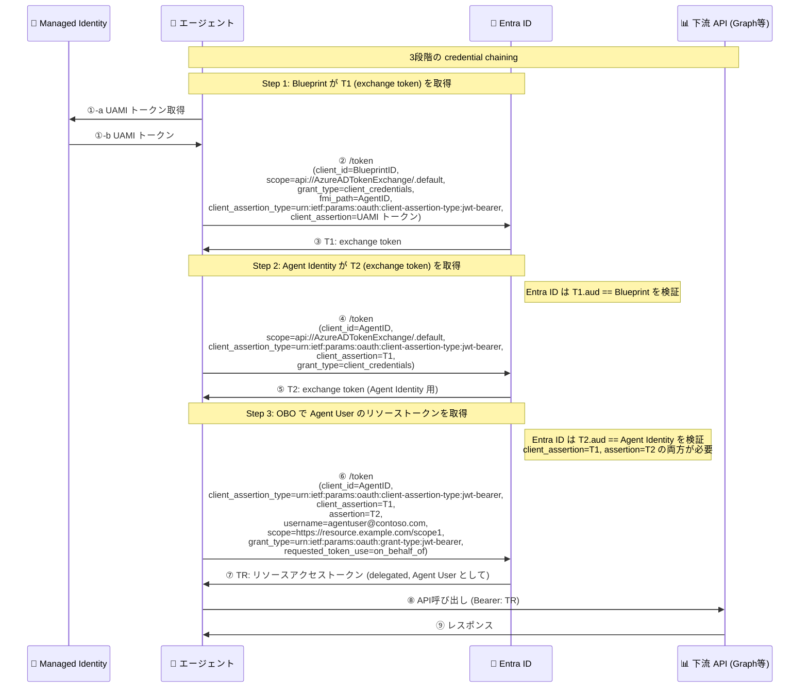
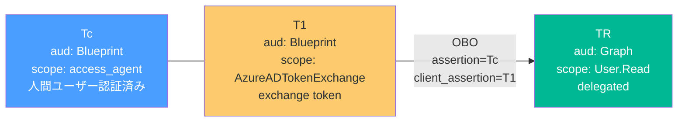
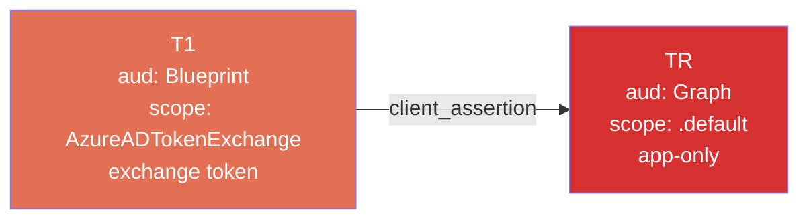
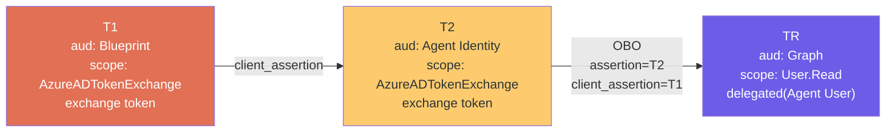

# Agent Identity OAuth フロー比較（Interactive Agent / Autonomous Agent App Flow / Autonomous Agent User Flow）

[English](./agent-identity-oauth-flow-comparison.md) | [日本語](./agent-identity-oauth-flow-comparison.ja.md)

## 1. Interactive Agent（ユーザー委任型）

人間のユーザーが対話的にエージェントを呼び出し、**ユーザーの権限（delegated permissions）** でリソースにアクセスするパターン。

公式ドキュメント:

- [interactive-agent-authenticate-user](https://learn.microsoft.com/en-us/entra/agent-id/identity-platform/interactive-agent-authenticate-user) — ユーザー認証
- [interactive-agent-request-user-authorization](https://learn.microsoft.com/en-us/entra/agent-id/identity-platform/interactive-agent-request-user-authorization) — ユーザー同意
- [interactive-agent-request-user-tokens](https://learn.microsoft.com/en-us/entra/agent-id/identity-platform/interactive-agent-request-user-tokens) — OBO トークン取得の実装手順
- [agent-on-behalf-of-oauth-flow](https://learn.microsoft.com/en-us/entra/agent-id/identity-platform/agent-on-behalf-of-oauth-flow) — OBO プロトコルの詳細フロー



### Step B の補足: なぜ `response_type=none` なのか

- Step B の /authorize リクエストでは **`response_type=none`** が指定される
- これは authorization code を取得するためではなく、**同意(consent)の記録のみ**が目的
- Entra ID はユーザーの同意をテナントに記録し、以降の OBO フローで同意済みとして扱う
- `client_id` には **Agent Identity の ID**（Blueprint ID ではない）を使用する
- 公式ドキュメントの例: エージェントがチャットウィンドウ内にリンクとして同意 URL を提示する

### Step C の補足: なぜ T1 が必要なのか

- 公式 OBO プロトコルでは、エージェントは OBO 交換の前に **T1 (exchange token)** を取得する必要がある
- T1 の取得方法は Autonomous Agent と同一（`client_credentials` + `fmi_path`）
- OBO 交換では `client_assertion=T1` と `assertion=Tc` の **2つのトークンを同時に提示**
- Entra ID は **T1.aud == Blueprint** かつ **Tc.aud == Blueprint** を検証する
- エージェント自身は `/authorize` エンドポイントを使用できない（公式: "Agents aren't supported for OBO `/authorize` flows"）
- サポートされている grant type は `client_credentials`、`jwt-bearer`、`refresh_token` のみ

### 3 つのステップの詳細

| ステップ                 | 概要                                                                                                                                                 | ドキュメント                                                                                                                                  |
| ------------------------ | ---------------------------------------------------------------------------------------------------------------------------------------------------- | --------------------------------------------------------------------------------------------------------------------------------------------- |
| **Step A: ユーザー認証** | クライアントが OAuth 2.0 Authorization Code Flow で Entra ID にリダイレクトし、Agent Identity Blueprint を audience とするアクセストークン Tc を取得 | [authenticate-user](https://learn.microsoft.com/en-us/entra/agent-id/identity-platform/interactive-agent-authenticate-user)                   |
| **Step B: ユーザー同意** | エージェントが下流 API にアクセスするための delegated permission をユーザーに同意させる                                                              | [request-user-authorization](https://learn.microsoft.com/en-us/entra/agent-id/identity-platform/interactive-agent-request-user-authorization) |
| **Step C-1: T1 取得**    | エージェントが Blueprint の credential で exchange token T1 を取得（Autonomous と同じ仕組み）                                                        | [agent-on-behalf-of-oauth-flow](https://learn.microsoft.com/en-us/entra/agent-id/identity-platform/agent-on-behalf-of-oauth-flow)             |
| **Step C-2: OBO 交換**   | T1 + Tc を提示して OBO でリソーストークン TR を取得                                                                                                  | [request-user-tokens](https://learn.microsoft.com/en-us/entra/agent-id/identity-platform/interactive-agent-request-user-tokens)               |

---

## 2. Autonomous Agent App Flow（自律型 — アプリ権限）

ユーザーの介在なしに、**エージェント自身の権限（application permissions）** で動作するパターン。
公式ドキュメント:

- [autonomous-agent-request-tokens](https://learn.microsoft.com/en-us/entra/agent-id/identity-platform/autonomous-agent-request-tokens) — トークン取得の実装手順
- [agent-autonomous-app-oauth-flow](https://learn.microsoft.com/en-us/entra/agent-id/identity-platform/agent-autonomous-app-oauth-flow) — App-only プロトコルの詳細フロー

### Blueprint と Agent Identity の親子関係



- Blueprint は複数の Agent Identity を impersonate できる（1:N）
- 1つの Agent Identity は 1つの Blueprint にのみ所属できる
- Agent Identity は常にシングルテナント

### トークン取得フロー



### Step 1 の credential 種別

| credential 種別             | パラメータ                                                                                                        | 用途                                       |
| --------------------------- | ----------------------------------------------------------------------------------------------------------------- | ------------------------------------------ |
| **Managed Identity (推奨)** | `client_assertion_type=urn:ietf:params:oauth:client-assertion-type:jwt-bearer` + `client_assertion=UAMI トークン` | 本番環境（自動ローテーション、安全な保管） |
| **Certificate**             | `client_assertion_type=urn:ietf:params:oauth:client-assertion-type:jwt-bearer` + `client_assertion=署名付きJWT`   | 本番環境                                   |
| **Client Secret (非推奨)**  | `client_secret=<secret>`                                                                                          | ローカル開発のみ                           |

---

## 3. Autonomous Agent User Flow（Agent User Impersonation）

Autonomous Agent が**ユーザーコンテキスト（Agent User）を持って**リソースにアクセスするパターン。
人間のユーザーが直接ログインするわけではなく、エージェントが **Agent User を impersonate** して delegated 権限でリソースにアクセスする。

公式ドキュメント: [agent-user-oauth-flow](https://learn.microsoft.com/en-us/entra/agent-id/identity-platform/agent-user-oauth-flow) — Agent User Impersonation プロトコル

### impersonate チェーン



- Blueprint → Agent Identity → Agent User の **credential chaining**
- Agent User は **1つの Agent Identity からのみ** impersonate 可能
- アクセスは Agent Identity に割り当てられた **delegation の範囲内** にスコープされる

### トークン取得フロー（3段階）



### 3 ステップの詳細

| ステップ         | client_id   | scope                                 | assertion / credential                                            | 返却トークン                      |
| ---------------- | ----------- | ------------------------------------- | ----------------------------------------------------------------- | --------------------------------- |
| **Step 1**       | BlueprintID | `api://AzureADTokenExchange/.default` | `client_assertion=UAMI` + `fmi_path=AgentID`                      | **T1** (exchange)                 |
| **Step 2**       | AgentID     | `api://AzureADTokenExchange/.default` | `client_assertion=T1`                                             | **T2** (exchange)                 |
| **Step 3** (OBO) | AgentID     | `https://resource.example.com/scope1` | `client_assertion=T1` + `assertion=T2` + `username=agentuser@...` | **TR** (delegated resource token) |

> **重要**: Step 2 と Step 3 で **同じ `client_id=AgentID`** を使用する必要がある。これは特権エスカレーション攻撃を防止するための制約。

### Autonomous Agent App Flow との違い

|                          | Autonomous Agent App Flow              | Autonomous Agent User Flow                          |
| ------------------------ | -------------------------------------- | --------------------------------------------------- |
| **トークン段数**         | 2段階（T1 → TR）                       | 3段階（T1 → T2 → OBO → TR）                         |
| **最終トークン**         | app-only (application 権限)            | **delegated** (Agent User の権限)                   |
| **ユーザーコンテキスト** | なし                                   | Agent User                                          |
| **grant_type (最終)**    | `client_credentials`                   | `urn:ietf:params:oauth:grant-type:jwt-bearer` (OBO) |
| **scope (最終)**         | `https://graph.microsoft.com/.default` | 個別スコープ（例: `User.Read`）                     |
| **subject**              | Agent Identity 自体                    | Agent User                                          |

---

## 4. トークンの違い

### 4-1. Interactive Agent



### 4-2. Autonomous Agent App Flow



### 4-3. Autonomous Agent User Flow



---

## 5. 比較表

|                                | Interactive Agent                                                                                                                 | Autonomous Agent App Flow                                                                                                             | Autonomous Agent User Flow                                                                                        |
| ------------------------------ | --------------------------------------------------------------------------------------------------------------------------------- | ------------------------------------------------------------------------------------------------------------------------------------- | ----------------------------------------------------------------------------------------------------------------- |
| **誰の権限で動作**             | 人間ユーザー (delegated)                                                                                                          | エージェント自身 (application)                                                                                                        | Agent User (delegated)                                                                                            |
| **人間ユーザーの認証**         | 必要                                                                                                                              | 不要                                                                                                                                  | 不要                                                                                                              |
| **人間ユーザーの同意**         | 必要（OAuth consent）                                                                                                             | 不要                                                                                                                                  | 不要                                                                                                              |
| **subject**                    | 人間ユーザー                                                                                                                      | Agent Identity                                                                                                                        | Agent User                                                                                                        |
| **トークン取得方法**           | Auth Code → OBO                                                                                                                   | Client Credentials 2段階                                                                                                              | Client Credentials 2段階 + OBO                                                                                    |
| **トークン数**                 | 3つ (Tc + T1 → TR)                                                                                                                | 2つ (T1 → TR)                                                                                                                         | 3つ (T1 → T2 → TR)                                                                                                |
| **最終 token の種類**          | delegated                                                                                                                         | app-only                                                                                                                              | **delegated** (Agent User として)                                                                                 |
| **最終 grant_type**            | OBO (jwt-bearer)                                                                                                                  | client_credentials                                                                                                                    | OBO (jwt-bearer)                                                                                                  |
| **credential**                 | BlueprintのMSI/cert/secret + クライアントsecret                                                                                   | MSI(推奨) / cert / secret                                                                                                             | MSI(推奨) / cert / secret                                                                                         |
| **client_id の使い分け**       | 認証=ClientApp, T1=Blueprint, 同意/OBO=AgentID                                                                                    | Step1=Blueprint, Step2=AgentID                                                                                                        | Step1=Blueprint, Step2-3=AgentID                                                                                  |
| **公式プロトコルドキュメント** | [agent-on-behalf-of-oauth-flow](https://learn.microsoft.com/en-us/entra/agent-id/identity-platform/agent-on-behalf-of-oauth-flow) | [agent-autonomous-app-oauth-flow](https://learn.microsoft.com/en-us/entra/agent-id/identity-platform/agent-autonomous-app-oauth-flow) | [agent-user-oauth-flow](https://learn.microsoft.com/en-us/entra/agent-id/identity-platform/agent-user-oauth-flow) |
| **ユースケース**               | チャットで指示→ユーザー代理操作                                                                                                   | バックグラウンドジョブ等                                                                                                              | 自律的にユーザー代理でリソースアクセス                                                                            |

---

## 6. 核心ポイント

3つのフローはすべて複数段階のトークン取得が必要だが、その仕組みと最終的に得られるトークンが異なる：

### Interactive Agent

1. **Tc**（クライアント → エージェント API）: audience が Agent Blueprint、scope が `access_agent`。人間ユーザーの認証を含む
2. **T1**（エージェント 内部）: Blueprint の credential で `client_credentials` + `fmi_path` で取得。Autonomous と同じ仕組み
3. **TR**（エージェント API → 下流 API）: T1 + Tc を提示して **OBO** で交換。audience は下流 API、delegated permission
4. ユーザーが明示的に同意した権限の範囲内でのみリソースにアクセス可能

### Autonomous Agent App Flow

1. **T1 (exchange token)**: Blueprint が `client_credentials` + `fmi_path` + credential で取得。aud == Blueprint
2. **TR (resource access token)**: T1 を `client_assertion` として交換。**app-only** 権限
3. ユーザーの介在なし。テナント管理者が付与したアプリ権限で動作

### Autonomous Agent User Flow

1. **T1 (exchange token)**: App Flow と同一。Blueprint が credential chaining の起点
2. **T2 (exchange token)**: T1 を `client_assertion` として Agent Identity 用の exchange token を取得。aud == Agent Identity
3. **TR (delegated resource token)**: T1 と T2 の両方を使って **OBO** で交換。Agent User の **delegated** 権限
4. 人間ユーザーの介在なしだが、Agent User のユーザーコンテキストで delegated アクセス

### 3つのフローの本質的な違い

```text
Interactive:          人間ユーザー認証 → Tc + T1      → OBO        → TR (delegated, 人間ユーザー)
Autonomous Agent App:    アプリ認証    → T1           → assertion  → TR (app-only)
Autonomous Agent User:   アプリ認証    → T1      → T2 → OBO        → TR (delegated, Agent User)
```

- **3つのフローすべてで T1（exchange token）の取得が共通**: Blueprint の `client_credentials` + `fmi_path` で取得する部分は同一
- **Interactive** と **Autonomous Agent User Flow** は最終的に delegated トークンを得る点で共通だが、subject が「人間ユーザー」か「Agent User」かで異なる
- **Autonomous Agent App Flow** だけが app-only トークンを取得する
- **Autonomous Agent User Flow** は Autonomous Agent App Flow の Step 1-2 を共有しつつ、Step 3 で追加の OBO 交換を行う点が特徴的
