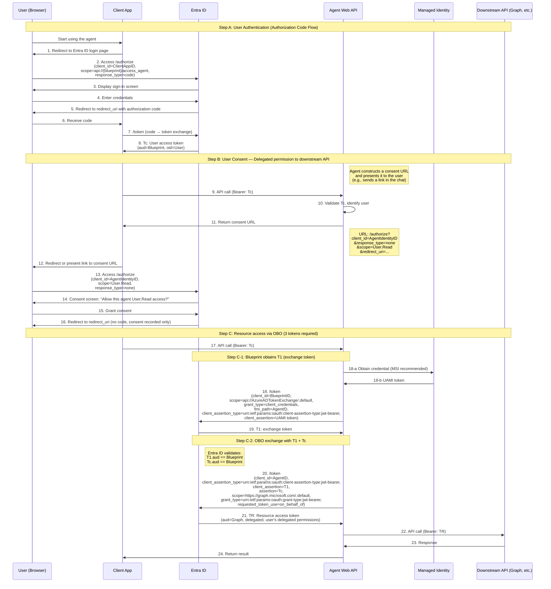
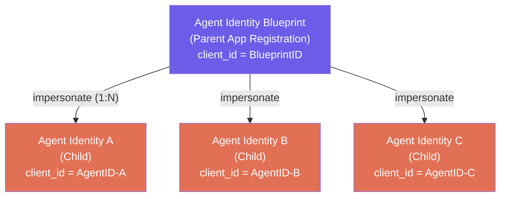
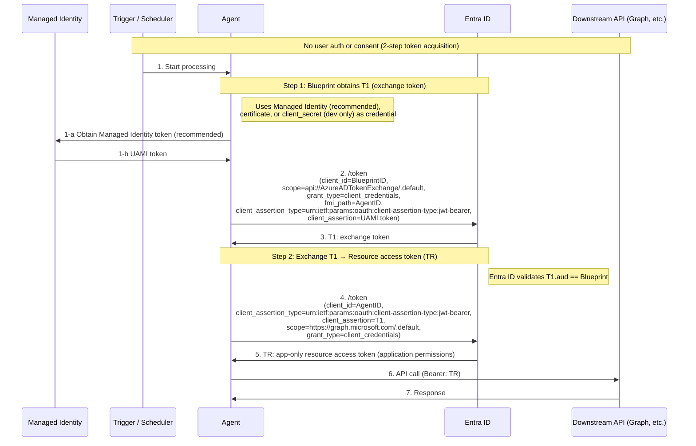
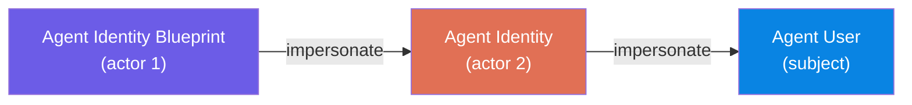
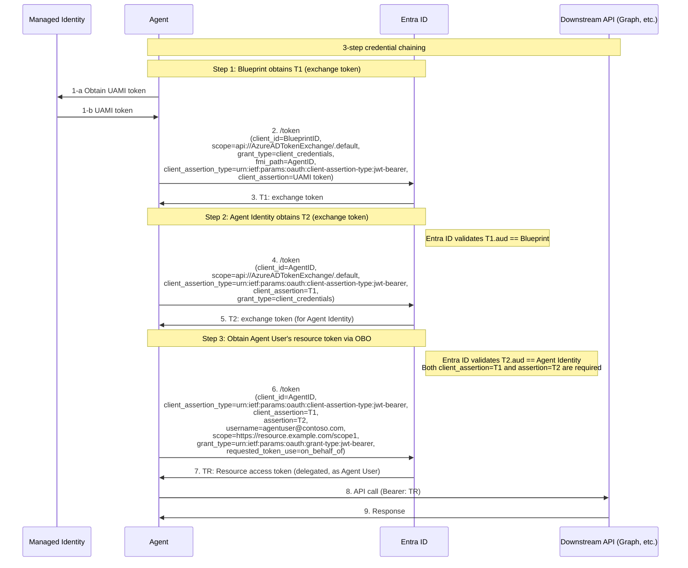
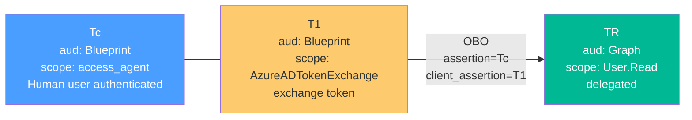
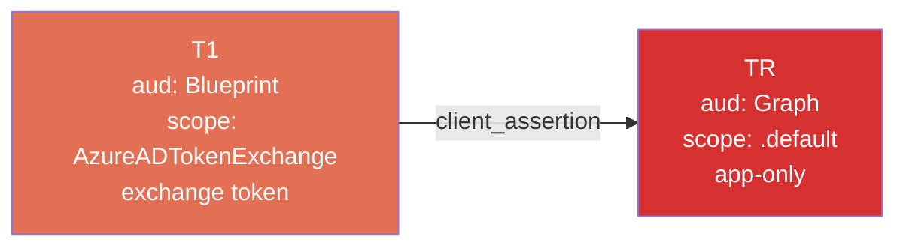
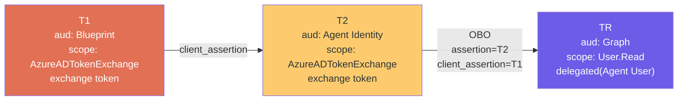

# Agent Identity OAuth Flow Comparison (Interactive Agent / Autonomous Agent App Flow / Autonomous Agent User Flow)

[English](./agent-identity-oauth-flow-comparison.md) | [日本語](./agent-identity-oauth-flow-comparison.ja.md)

## 1. Interactive Agent (User-Delegated)

A pattern where a human user interactively invokes the agent, which then accesses resources with the **user's permissions (delegated permissions)**.

Official documentation:

- [interactive-agent-authenticate-user](https://learn.microsoft.com/en-us/entra/agent-id/identity-platform/interactive-agent-authenticate-user) — User authentication
- [interactive-agent-request-user-authorization](https://learn.microsoft.com/en-us/entra/agent-id/identity-platform/interactive-agent-request-user-authorization) — User consent
- [interactive-agent-request-user-tokens](https://learn.microsoft.com/en-us/entra/agent-id/identity-platform/interactive-agent-request-user-tokens) — OBO token acquisition implementation
- [agent-on-behalf-of-oauth-flow](https://learn.microsoft.com/en-us/entra/agent-id/identity-platform/agent-on-behalf-of-oauth-flow) — Detailed OBO protocol flow



### Step B Notes: Why `response_type=none`

- The /authorize request in Step B specifies **`response_type=none`**
- This is not for obtaining an authorization code — it is **solely for recording consent**
- Entra ID records the user's consent in the tenant and treats it as pre-consented in subsequent OBO flows
- The `client_id` uses the **Agent Identity's ID** (not the Blueprint ID)
- Example from official docs: The agent presents the consent URL as a link within the chat window

### Step C Notes: Why T1 Is Required

- Per the official OBO protocol, the agent must obtain **T1 (exchange token)** before the OBO exchange
- T1 acquisition uses the same mechanism as Autonomous Agent (`client_credentials` + `fmi_path`)
- The OBO exchange presents **two tokens simultaneously**: `client_assertion=T1` and `assertion=Tc`
- Entra ID validates that **T1.aud == Blueprint** and **Tc.aud == Blueprint**
- The agent itself cannot use the `/authorize` endpoint (official: "Agents aren't supported for OBO `/authorize` flows")
- Supported grant types are `client_credentials`, `jwt-bearer`, and `refresh_token` only

### Three Steps in Detail

| Step                       | Summary                                                                                                                                          | Documentation                                                                                                                                 |
| -------------------------- | ------------------------------------------------------------------------------------------------------------------------------------------------ | --------------------------------------------------------------------------------------------------------------------------------------------- |
| **Step A: User Auth**      | The client redirects to Entra ID via OAuth 2.0 Authorization Code Flow and obtains access token Tc with the Agent Identity Blueprint as audience | [authenticate-user](https://learn.microsoft.com/en-us/entra/agent-id/identity-platform/interactive-agent-authenticate-user)                   |
| **Step B: User Consent**   | The user grants delegated permission for the agent to access the downstream API                                                                  | [request-user-authorization](https://learn.microsoft.com/en-us/entra/agent-id/identity-platform/interactive-agent-request-user-authorization) |
| **Step C-1: Obtain T1**    | The agent uses the Blueprint's credential to obtain exchange token T1 (same mechanism as Autonomous)                                             | [agent-on-behalf-of-oauth-flow](https://learn.microsoft.com/en-us/entra/agent-id/identity-platform/agent-on-behalf-of-oauth-flow)             |
| **Step C-2: OBO Exchange** | Presents T1 + Tc to obtain resource token TR via OBO                                                                                             | [request-user-tokens](https://learn.microsoft.com/en-us/entra/agent-id/identity-platform/interactive-agent-request-user-tokens)               |

---

## 2. Autonomous Agent App Flow (Autonomous — Application Permissions)

A pattern where the agent operates without user involvement, using its **own permissions (application permissions)**.

Official documentation:

- [autonomous-agent-request-tokens](https://learn.microsoft.com/en-us/entra/agent-id/identity-platform/autonomous-agent-request-tokens) — Token acquisition implementation
- [agent-autonomous-app-oauth-flow](https://learn.microsoft.com/en-us/entra/agent-id/identity-platform/agent-autonomous-app-oauth-flow) — Detailed app-only protocol flow

### Parent-Child Relationship Between Blueprint and Agent Identity



- A Blueprint can impersonate multiple Agent Identities (1:N)
- Each Agent Identity belongs to exactly one Blueprint
- Agent Identities are always single-tenant

### Token Acquisition Flow



### Step 1 Credential Types

| Credential Type                     | Parameters                                                                                                     | Use Case                                   |
| ----------------------------------- | -------------------------------------------------------------------------------------------------------------- | ------------------------------------------ |
| **Managed Identity (recommended)**  | `client_assertion_type=urn:ietf:params:oauth:client-assertion-type:jwt-bearer` + `client_assertion=UAMI token` | Production (auto-rotation, secure storage) |
| **Certificate**                     | `client_assertion_type=urn:ietf:params:oauth:client-assertion-type:jwt-bearer` + `client_assertion=signed JWT` | Production                                 |
| **Client Secret (not recommended)** | `client_secret=<secret>`                                                                                       | Local development only                     |

---

## 3. Autonomous Agent User Flow (Agent User Impersonation)

A pattern where an Autonomous Agent accesses resources **with a user context (Agent User)**.
Rather than a human user logging in directly, the agent **impersonates an Agent User** and accesses resources with delegated permissions.

Official documentation: [agent-user-oauth-flow](https://learn.microsoft.com/en-us/entra/agent-id/identity-platform/agent-user-oauth-flow) — Agent User Impersonation protocol

### Impersonate Chain



- **Credential chaining** from Blueprint → Agent Identity → Agent User
- An Agent User can only be impersonated by **one Agent Identity**
- Access is scoped within the **delegation assigned to the Agent Identity**

### Token Acquisition Flow (3 Steps)



### Three Steps in Detail

| Step             | client_id   | scope                                 | assertion / credential                                            | Returned Token                    |
| ---------------- | ----------- | ------------------------------------- | ----------------------------------------------------------------- | --------------------------------- |
| **Step 1**       | BlueprintID | `api://AzureADTokenExchange/.default` | `client_assertion=UAMI` + `fmi_path=AgentID`                      | **T1** (exchange)                 |
| **Step 2**       | AgentID     | `api://AzureADTokenExchange/.default` | `client_assertion=T1`                                             | **T2** (exchange)                 |
| **Step 3** (OBO) | AgentID     | `https://resource.example.com/scope1` | `client_assertion=T1` + `assertion=T2` + `username=agentuser@...` | **TR** (delegated resource token) |

> **Important**: Steps 2 and 3 must use the **same `client_id=AgentID`**. This constraint prevents privilege escalation attacks.

### Differences from Autonomous Agent App Flow

|                      | Autonomous Agent App Flow              | Autonomous Agent User Flow                          |
| -------------------- | -------------------------------------- | --------------------------------------------------- |
| **Token steps**      | 2 steps (T1 → TR)                      | 3 steps (T1 → T2 → OBO → TR)                        |
| **Final token**      | app-only (application permissions)     | **delegated** (Agent User's permissions)            |
| **User context**     | None                                   | Agent User                                          |
| **Final grant_type** | `client_credentials`                   | `urn:ietf:params:oauth:grant-type:jwt-bearer` (OBO) |
| **Final scope**      | `https://graph.microsoft.com/.default` | Individual scopes (e.g., `User.Read`)               |
| **Subject**          | Agent Identity itself                  | Agent User                                          |

---

## 4. Token Differences

### 4-1. Interactive Agent



### 4-2. Autonomous Agent App Flow



### 4-3. Autonomous Agent User Flow



---

## 5. Comparison Table

|                              | Interactive Agent                                                                                                                 | Autonomous Agent App Flow                                                                                                             | Autonomous Agent User Flow                                                                                        |
| ---------------------------- | --------------------------------------------------------------------------------------------------------------------------------- | ------------------------------------------------------------------------------------------------------------------------------------- | ----------------------------------------------------------------------------------------------------------------- |
| **Whose permissions**        | Human user (delegated)                                                                                                            | Agent itself (application)                                                                                                            | Agent User (delegated)                                                                                            |
| **Human user auth**          | Required                                                                                                                          | Not required                                                                                                                          | Not required                                                                                                      |
| **Human user consent**       | Required (OAuth consent)                                                                                                          | Not required                                                                                                                          | Not required                                                                                                      |
| **Subject**                  | Human user                                                                                                                        | Agent Identity                                                                                                                        | Agent User                                                                                                        |
| **Token acquisition method** | Auth Code → OBO                                                                                                                   | Client Credentials (2-step)                                                                                                           | Client Credentials (2-step) + OBO                                                                                 |
| **Number of tokens**         | 3 (Tc + T1 → TR)                                                                                                                  | 2 (T1 → TR)                                                                                                                           | 3 (T1 → T2 → TR)                                                                                                  |
| **Final token type**         | delegated                                                                                                                         | app-only                                                                                                                              | **delegated** (as Agent User)                                                                                     |
| **Final grant_type**         | OBO (jwt-bearer)                                                                                                                  | client_credentials                                                                                                                    | OBO (jwt-bearer)                                                                                                  |
| **Credential**               | Blueprint MSI/cert/secret + client secret                                                                                         | MSI (recommended) / cert / secret                                                                                                     | MSI (recommended) / cert / secret                                                                                 |
| **client_id usage**          | Auth=ClientApp, T1=Blueprint, Consent/OBO=AgentID                                                                                 | Step1=Blueprint, Step2=AgentID                                                                                                        | Step1=Blueprint, Step2-3=AgentID                                                                                  |
| **Official protocol doc**    | [agent-on-behalf-of-oauth-flow](https://learn.microsoft.com/en-us/entra/agent-id/identity-platform/agent-on-behalf-of-oauth-flow) | [agent-autonomous-app-oauth-flow](https://learn.microsoft.com/en-us/entra/agent-id/identity-platform/agent-autonomous-app-oauth-flow) | [agent-user-oauth-flow](https://learn.microsoft.com/en-us/entra/agent-id/identity-platform/agent-user-oauth-flow) |
| **Use case**                 | Chat-based instructions → user-delegated operations                                                                               | Background jobs, etc.                                                                                                                 | Autonomous resource access on behalf of a user                                                                    |

---

## 6. Key Takeaways

All three flows require multi-step token acquisition, but the mechanisms and the final tokens differ:

### Interactive Agent

1. **Tc** (Client → Agent API): audience is Agent Blueprint, scope is `access_agent`. Includes human user authentication
2. **T1** (Agent internal): Obtained via `client_credentials` + `fmi_path` with Blueprint's credential. Same mechanism as Autonomous
3. **TR** (Agent API → Downstream API): Exchanged via **OBO** by presenting T1 + Tc. audience is the downstream API, delegated permission
4. Resource access is limited to the scope of permissions explicitly consented to by the user

### Autonomous Agent App Flow

1. **T1 (exchange token)**: Blueprint obtains via `client_credentials` + `fmi_path` + credential. aud == Blueprint
2. **TR (resource access token)**: Exchanged using T1 as `client_assertion`. **app-only** permissions
3. No user involvement. Operates with application permissions granted by the tenant administrator

### Autonomous Agent User Flow

1. **T1 (exchange token)**: Same as App Flow. Blueprint serves as the starting point for credential chaining
2. **T2 (exchange token)**: Obtained using T1 as `client_assertion` for the Agent Identity's exchange token. aud == Agent Identity
3. **TR (delegated resource token)**: Exchanged via **OBO** using both T1 and T2. Agent User's **delegated** permissions
4. No human user involvement, but accesses resources with the Agent User's user context as delegated

### The Essential Differences Between the Three Flows

```text
Interactive:           Human user auth → Tc + T1      → OBO        → TR (delegated, human user)
Autonomous Agent App:  App auth        → T1           → assertion  → TR (app-only)
Autonomous Agent User: App auth        → T1      → T2 → OBO        → TR (delegated, Agent User)
```

- **T1 (exchange token) acquisition is common across all three flows**: The part that uses Blueprint's `client_credentials` + `fmi_path` is identical
- **Interactive** and **Autonomous Agent User Flow** both ultimately obtain delegated tokens, but differ in whether the subject is a "human user" or an "Agent User"
- **Autonomous Agent App Flow** is the only one that obtains an app-only token
- **Autonomous Agent User Flow** shares Steps 1-2 with Autonomous Agent App Flow, but is distinctive in performing an additional OBO exchange in Step 3
