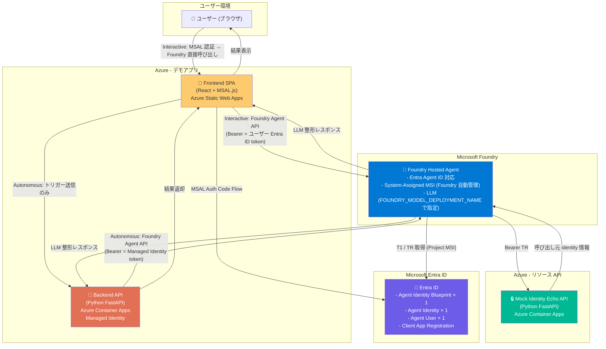
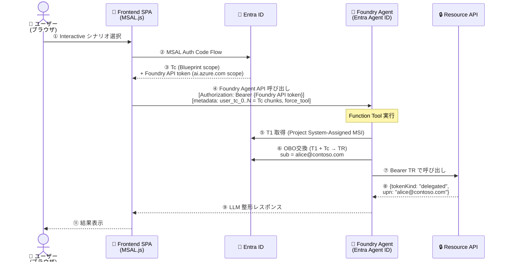
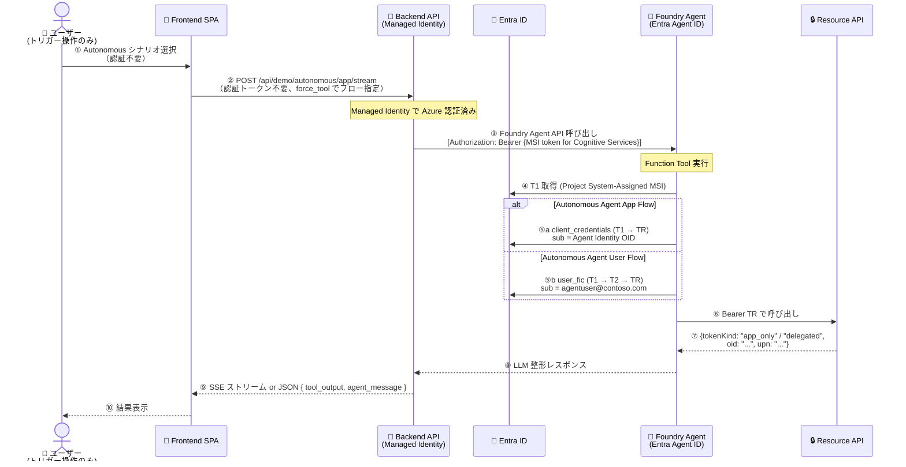
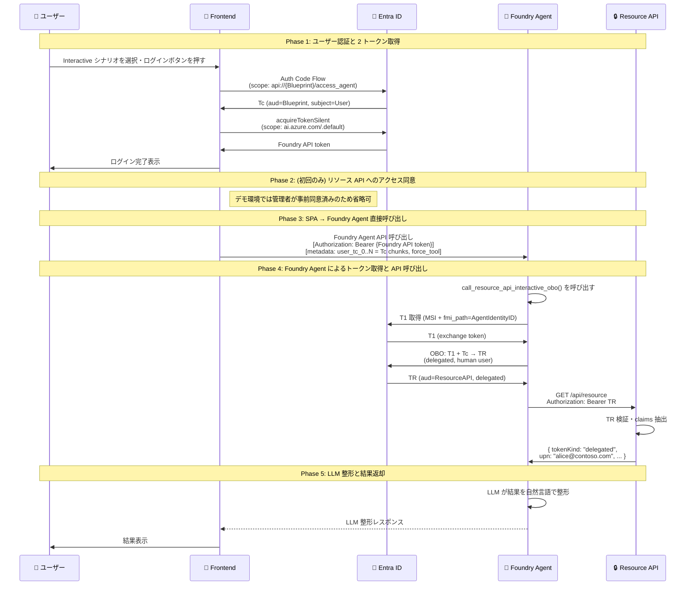
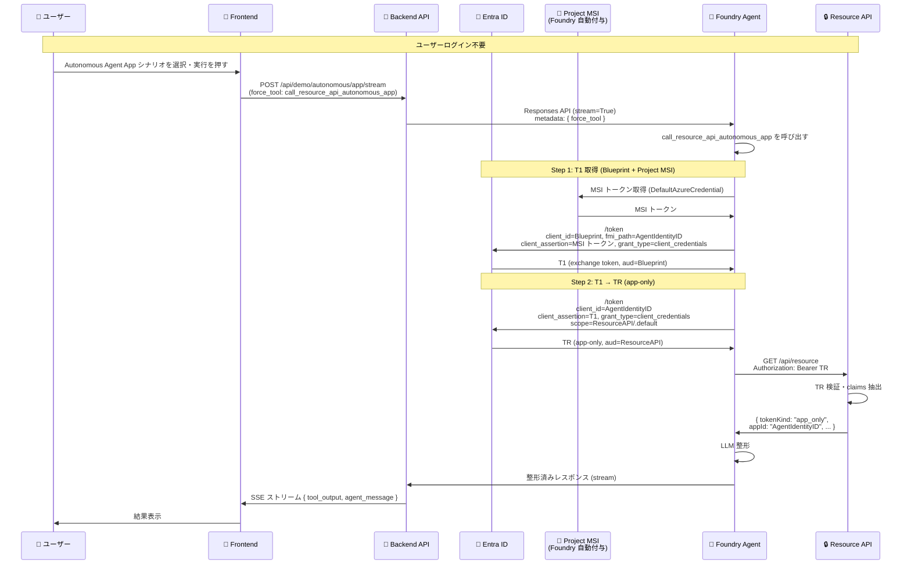
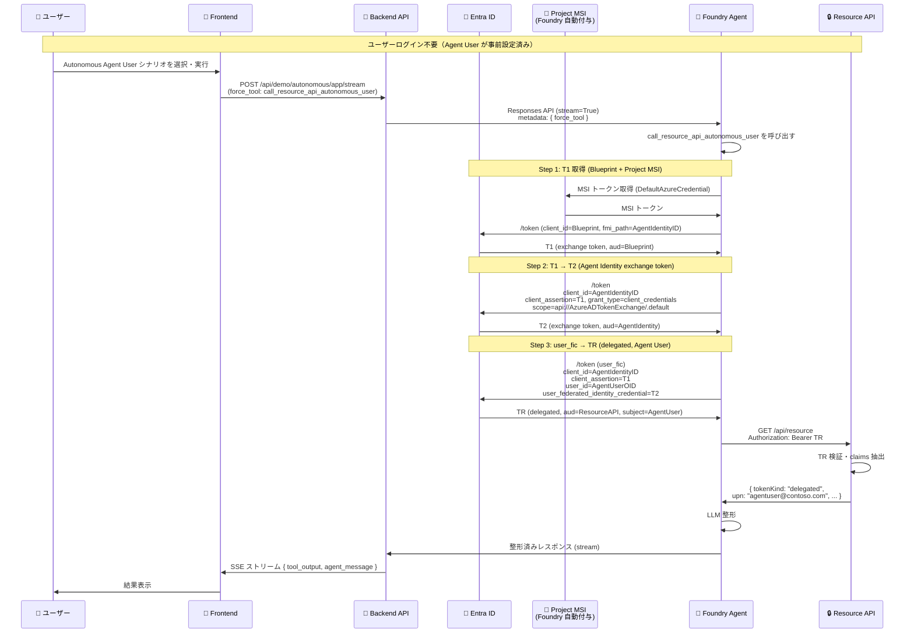

# Entra Agent ID デモアプリ 概要設計書 (レビュー中)

| 項目               | 内容                                 |
| ------------------ | ------------------------------------ |
| **ドキュメント名** | Entra Agent ID デモアプリ 概要設計書 |
| **バージョン**     | 1.0                                  |
| **作成日**         | 2026-03-26                           |
| **最終更新日**     | 2026-03-27                           |
| **ステータス**     | ドラフト                             |

---

## 1. はじめに

### 1.1 背景と目的

Microsoft Entra Agent ID は AI エージェントに対して Entra ID の ID 管理機能を与える仕組みであり、「誰の権限でリソースにアクセスするか」という **アイデンティティの帰属（attribution）** を明示する点に本質的な価値がある。

しかしその仕組みは複数のトークン交換ステップを含む複雑なプロトコルであり、動くコードを見るだけでは直感的に理解しにくい。

本デモアプリは以下を目的とする：

- **3 つのフローの違いを体感できる**: Interactive / Autonomous Agent App / Autonomous Agent User それぞれで「誰の資格情報でリソース API が呼ばれたか」を同一画面で比較参照できる
- **Foundry Agent Service + Entra Agent ID の統合を実機で示す**: Microsoft Foundry に Hosted Agent を置き、実際のトークン取得フローを経てリソース API を呼ぶ
- **エージェントが整形・解説する**: 呼び出し結果の生データを Foundry Hosted Agent の LLM が自然言語で説明し、技術的な背景まで含めて分かりやすく提示する

### 1.2 デモが示すコアコンセプト

> **「同一エージェントが 3 つのフローを切り替えて動作し、リソース API が誰からのアクセスと認識したかを比較する」**

3 シナリオで「誰の権限か」が変わる本質は、Agent Identity の**数ではなく**、トークンの **subject（呼び出し主体クレーム）** にある。同一の Agent Identity が 3 フローを実行した場合でも、リソース API には明確に異なる呼び出し元が見える。

| シナリオ | フロー                     | API が認識する caller (sub/upn)             | トークン種別 |
| -------- | -------------------------- | ------------------------------------------- | ------------ |
| A        | Interactive Flow           | 人間ユーザー本人 (例: alice@contoso.com)    | delegated    |
| B        | Autonomous Agent App Flow  | Agent Identity 自身（サービスプリンシパル） | app-only     |
| C        | Autonomous Agent User Flow | Agent User (例: agentuser@contoso.com)      | delegated    |

これは同時に **Entra Agent ID のコアバリュー** を体現する：1 つのエージェントが、呼び出し文脈に応じて Interactive にも Autonomous にもなれる。

---

## 2. アイデアレビュー

ユーザーから提案されたアイデアを以下の観点でレビューする。

### 2.1 良い点（強みとなる設計方針）

#### ✅ 「誰の権限でアクセスしたか」を可視化する軸

Entra Agent ID の本質的価値は**アイデンティティの分離と帰属**にある。リソース API が返す「呼び出し元 identity 情報」でその価値を直接体験できる。

#### ✅ Interactive と Autonomous の両方を網羅

2 つの極端なケース（ユーザー委任型 / エージェント自律型）を同一 UI で比較できることにより、エージェント認証設計の選択肢として理解しやすくなる。

#### ✅ 同一エージェント（同一 Agent Identity）が Interactive / Autonomous 両モードで動作できる

これは公式ドキュメントが明示する Entra Agent ID の重要な強みの一つである。

- **技術的な根拠**: Agent Identity は `client_credentials` (Autonomous Agent App)、`user_fic` (Autonomous Agent User)、`jwt-bearer` OBO (Interactive) の**複数の grant type をサポートする**。公式ドキュメントにも「Agent identities use `client_credentials` for app-only autonomous operations and the `jwt-bearer` grant type supports both client credential flow and OBO flow, providing **flexibility in delegation patterns**」と明記されている。なお Autonomous Agent User の Agent User トークン取得は OBO（`jwt-bearer` grant）ではなく、専用の `user_fic` grant type を使用する。
- **3 シナリオで異なる caller が見える理由はトークンの subject**: 同一 Agent Identity が 3 フローを実行しても、リソース API は完全に異なる呼び出し元を認識する（Interactive → 人間ユーザーの sub/upn、Autonomous Agent App → Agent Identity の appId が subject、Autonomous Agent User → Agent User の upn）。Agent Identity を複数用意する必要はない。
- **Blueprint が統括する統一ガバナンス**: 1 つの Blueprint の下に Agent Identity がまとめられることで、管理者は Blueprint を無効化することで Interactive/Autonomous すべてのフローをまとめてブロックできる。
- **デモでの利用方針**: 1 つの Published Agent App（= 1 Blueprint + 1 Agent Identity）で 3 シナリオすべてを実行する。「同じエージェント ID が 3 つの異なる権限コンテキストを使い分ける」ことをそのまま示せる。

#### ✅ Foundry Hosted Agent が整形・返却する役割

リソース API の生レスポンスをそのまま見せるのではなく、LLM が流れを解説することで**技術者以外にも伝わるデモ**になる。

### 2.2 追加・改善を推奨する点

#### 📌 Autonomous Agent は App Flow と User Flow の 2 種を区別して見せる

「Autonomous」には **App Flow（エージェント自身の権限）** と **User Flow（Agent User の委任権限）** という本質的に異なる 2 つのパターンがある。この 2 つを並べて見せることで、「自律エージェントでも delegated 権限を持てる」という点が明確になる。設計上は 3 シナリオ対応を推奨する。

#### 📌 Interactive と Autonomous では Foundry Agent の「呼び出し主体」が根本的に異なる

アーキテクチャ上の本質的な区別として、**Foundry Agent API を誰が呼び出すか**が 2 パターンに分かれる：

| 観点                               | Interactive Flow                          | Autonomous Flow                                  |
| ---------------------------------- | ----------------------------------------- | ------------------------------------------------ |
| Foundry Agent API の起動者         | **人間ユーザー**（ブラウザ）              | **システム**（Backend API の Managed Identity）  |
| Foundry API 呼び出しの認証トークン | ユーザーの Entra ID トークン（MSAL 取得） | Backend API の Azure Managed Identity トークン   |
| Tc（Blueprint スコープ）の要否     | 必要（OBO の起点、メッセージに含める）    | 不要                                             |
| エージェント内部での TR 取得方式   | OBO（Tc → TR、sub = 人間ユーザー）        | client_credentials または user_fic（Agent User） |
| フロントエンドの役割               | 認証・Foundry Agent 直接呼び出し          | トリガー送信と結果受取のみ                       |

この区別をアーキテクチャに明示することで、Entra Agent ID がいかに「呼び出しコンテキストを引き継ぐか」を正確にデモできる（詳細は § 3 参照）。

#### 📌 トークンフロー図をリアルタイムで表示する

UI にフローのステップを順番に「ハイライト」する可視化を入れると、認証フローを今まさに実行中であることが伝わり、デモとして印象的になる。

#### 📌 リソース API は専用 Mock API として実装する

Microsoft Graph の `/me` エンドポイントを使う選択肢もあるが、レスポンス形式の制御やデモ向けの読みやすいメッセージ生成のために、**専用 Mock Identity Echo API** として実装することを推奨する。

#### 📌 Interactive Flow における Consent UI を考慮する

Interactive Flow では Step B（ユーザーのリソース API へのアクセス同意）が必要になる。デモ環境ではあらかじめ管理者同意を付与しておくか、初回のみ同意 URL へのリダイレクトをデモの一部として見せる設計が必要。

#### 📌 Tc（ユーザートークン）の Foundry Agent への安全な受け渡し設計が必要

Interactive Flow では SPA が Foundry Agent API を直接呼び出し、Frontend が取得した Tc をメッセージペイロードに埋め込んで Function Tool に渡す。Backend API は Interactive Flow に関与しない設計とし、Tc のサーバーサイドセッション管理は不要とする。

---

## 3. システム全体アーキテクチャ

### 3.1 コンポーネント一覧

| コンポーネント           | 役割                                                                                                                                | 実装場所                              |
| ------------------------ | ----------------------------------------------------------------------------------------------------------------------------------- | ------------------------------------- |
| **Frontend SPA**         | シナリオ選択・結果表示。Interactive では MSAL 認証 + Foundry Agent 直接呼び出し。Autonomous では Backend API へのトリガー送信のみ。 | Azure Static Web Apps / Vite + React  |
| **Backend API**          | Autonomous フローの**システム起動者**。Managed Identity で Foundry Agent API を認証呼び出し。Interactive フローには非介在。         | Azure Container Apps (Python FastAPI) |
| **Foundry Hosted Agent** | トークン取得 (Entra Agent ID)・リソース API 呼び出し・LLM 整形                                                                      | Microsoft Foundry Agent Service       |
| **Resource API (Mock)**  | Bearer トークンを受け取り、呼び出し元 identity 情報を返す                                                                           | Azure Container Apps (Python FastAPI) |
| **Microsoft Entra ID**   | 認証・認可基盤 (Blueprint / Agent Identity / Agent User / Client App)                                                               | Azure                                 |

### 3.2 全体コンポーネント図



### 3.3 呼び出しパターン別シーケンス図

Interactive と Autonomous では Foundry Agent API を**誰が**呼び出すかが異なるため、それぞれを独立したシーケンス図で示す。

---

#### パターン A：Interactive Flow（ユーザー直接呼び出し）



> **ポイント**: Foundry Agent API を呼び出すのは**ユーザー本人**（MSAL で取得した Entra ID トークン）。リソース API への最終的な TR も同じユーザーを sub に持つ。Tc は metadata の chunks として Foundry Agent に渡し、ToolDispatchAgent が再結合する。

---

#### パターン B：Autonomous Flow（システム起動者）



> **ポイント**: Foundry Agent API を呼び出すのは**Backend API（Managed Identity）**。フロントエンドはトリガーと結果受取のみ担当。ユーザートークンは Foundry 側には渡らず、リソース API へのアクセスも Agent 自身または Agent User として実行される。

---

#### 呼び出し主体の対比

|                             | Interactive           | Autonomous Agent App | Autonomous Agent User |
| --------------------------- | --------------------- | -------------------- | --------------------- |
| Foundry API caller          | ユーザー (MSAL token) | Backend API (MSI)    | Backend API (MSI)     |
| Foundry 監査ログ上の caller | alice@contoso.com     | Backend API SP       | Backend API SP        |
| リソース API の TR.sub      | alice@contoso.com     | Agent Identity OID   | agentuser@contoso.com |
| フロントエンドの役割        | 認証 + 直接呼出し     | トリガーのみ         | トリガーのみ          |

---

#### 実装上の注意点（技術レビュー）

1. **Foundry Agent API への CORS サポート確認**
   Interactive パターン（ブラウザから直接呼び出し）では、Foundry Agent Service エンドポイントが CORS を許可しているか実装前に確認が必要。Microsoft Foundry ポータル自体がブラウザから同エンドポイントを呼び出しているため、CORS は有効と推定されるが、カスタムドメイン/オリジンの許可設定は要検証。

2. **Frontend の 2 トークン取得（Interactive のみ）**
   Interactive Flow では Frontend が MSAL で 2 種類のトークンを取得する：
   - **Tc**：`api://{blueprintId}/access_agent` スコープ（OBO の入力トークン）
   - **Foundry API トークン**：`https://ai.azure.com/.default` スコープ（Azure ML First-Party App の `user_impersonation`）

   MSAL の `acquireTokenSilent` を 2 回呼び出すことで実現できる。

3. **Tc の metadata chunks 渡し**
   Interactive Flow では SPA が Foundry Agent API を直接呼び出し、Tc を Responses API の `metadata` フィールドにチャンク分割して渡す。metadata の値は 512 文字制限があるため、Tc を 500 文字ずつに分割し `user_tc_0`, `user_tc_1`, ... として送信する。Agent 側の `ToolDispatchAgent` がチャンクを再結合し、`set_user_tc()` で module-level global に保存する。Function Tool は `get_user_tc()` で取得する。Backend API は Interactive Flow に関与しない。

4. **Backend API は Autonomous の「システム ID」として機能**
   Backend API の Managed Identity は Foundry プロジェクトの「AI Developer」または「Cognitive Services User」ロールが必要。このシステム ID 自体が Entra の認証エンティティとなる点がデモの Autonomous 側のメッセージとなる。

5. **Hosted Agent の呼び出し方法（実証済み）**
   Hosted Agent の呼び出しには OpenAI SDK の Responses API を使用し、`extra_body` で `agent_reference` を指定する。エンドポイントは `services.ai.azure.com` ドメインを使用する必要がある（`cognitiveservices.azure.com` ではない）。

   ```python
   from azure.identity import DefaultAzureCredential
   from azure.ai.projects import AIProjectClient

   # services.ai.azure.com ドメインを使用（cognitiveservices.azure.com ではない）
   project = AIProjectClient(
       endpoint="https://{account}.services.ai.azure.com/api/projects/{project}",
       credential=DefaultAzureCredential(),
       allow_preview=True,
   )
   openai = project.get_openai_client()
   agent = project.agents.get(agent_name=agent_name)

   response = openai.responses.create(
       input=[{"role": "user", "content": "..."}],
       extra_body={
           "agent_reference": {
               "name": agent.name,
               "type": "agent_reference",
           }
       },
   )
   ```

---

## 4. コンポーネント別設計

### 4.1 Frontend SPA

#### 役割

- タブ切り替えによるシナリオ選択
- Interactive Flow 時のユーザー認証（MSAL.js による Auth Code Flow）
- デモ実行トリガーと結果表示（SSE ストリーミング対応）

#### タブ構成（実装済み）

| タブ                        | 認証要否 | 呼び出し先                       | フロー切り替え                                                                                             |
| --------------------------- | -------- | -------------------------------- | ---------------------------------------------------------------------------------------------------------- |
| **Autonomous Agent**        | 不要     | Backend API (SSE)                | ツール選択で `call_resource_api_autonomous_app` / `call_resource_api_autonomous_user` を `force_tool` 指定 |
| **Interactive Agent (OBO)** | 必要     | Foundry Agent API (ブラウザ直接) | `call_resource_api_interactive_obo` を `force_tool` 指定                                                   |
| **No Agent**                | 不要     | (未使用)                         | MSAL 直接取得のトークンとの参照比較用                                                                      |

> **設計からの変更点**: 当初は Interactive / Autonomous App / Autonomous User の 3 タブを想定していたが、
> 実装では Autonomous を 1 タブに統合し、`force_tool` パラメータ（metadata 経由）でフローを切り替える方式とした。

#### UI 実装

- **UI フレームワーク不使用**: shadcn/ui + Tailwind CSS の採用は見送り、カスタム CSS (`App.css`) のみで実装
- **状態管理**: `useState` hooks のみ（Redux / Context 等は未使用）
- **SSE テキストバッチング**: `useRef` + `requestAnimationFrame` でストリーミング描画を最適化
- **ストリーム中断**: `useRef(AbortController)` で SSE ストリームのキャンセルをサポート

#### 認証処理（Interactive Flow 時）

Interactive Flow シナリオ選択時のみ MSAL.js を使ったログインが必要。

```text
MSAL Auth Code Flow:
  scope = api://{BlueprintAppId}/access_agent
  → Tc（audience: Blueprint、ユーザー認証済み）

取得した Tc は Foundry Agent API へのメッセージペイロードに
埋め込んで Function Tool に引き渡す
```

#### 主要な状態管理

| 状態              | 説明                                         |
| ----------------- | -------------------------------------------- |
| `messages`        | チャットメッセージ配列                       |
| `input`           | ユーザー入力テキスト                         |
| `streaming`       | SSE ストリーミング中フラグ                   |
| `selectedTool`    | 選択中のツール名 (`force_tool` として送信)   |
| `agentToolOutput` | Agent の Function Tool 出力 (JSON)           |
| `oboToolOutput`   | Interactive OBO の Function Tool 出力 (JSON) |
| `callerData`      | Identity Echo API の caller 情報             |

---

### 4.2 Backend API

#### 役割

- **Autonomous Flow 専用のシステム起動者**: フロントエンドからの Autonomous リクエストを受け付け、Managed Identity で Foundry Agent Service を呼び出す
- Interactive Flow には非介在（SPA が Foundry Agent API を直接呼び出す）
- Foundry Agent の Conversation 作成・メッセージ送信・Response 取得（Responses API / Agents v2）
- CORS 制御、レート制限

#### エンドポイント設計（実装済み）

```text
POST /api/demo/autonomous/app
  Body: { "message": "...", "force_tool?": "call_resource_api_autonomous_app" }
  → Foundry Agent に Responses API (同期) で呼び出し
  → JSON → { "tool_output?": {...}, "agent_message?": "..." }

POST /api/demo/autonomous/app/stream
  Body: { "message": "...", "force_tool?": "call_resource_api_autonomous_app" }
  → Foundry Agent に Responses API (stream=True) で呼び出し
  → SSE ストリーム: event: {type}\ndata: {json}\n\n

GET /health
  → { "status": "ok" }
```

> **設計からの変更点**:
>
> - `/api/demo/autonomous/user` エンドポイントは作成せず、`/api/demo/autonomous/app/stream` の `force_tool` パラメータで `call_resource_api_autonomous_user` を指定する方式に統一した。
> - 同期エンドポイント (`/app`) も残しているが、Frontend は主に **SSE ストリーミング** (`/app/stream`) を使用する。
> - レスポンス形式は `{ agentResponse, rawApiResponse }` から `{ tool_output?, agent_message? }` に変更。
>
> **Interactive Flow は Backend API を経由しない**: Interactive Flow では SPA が MSAL で取得した Foundry API トークンで Foundry Agent API を直接呼び出す。Tc は metadata chunks として Foundry Agent に渡す。これにより Backend API での Tc セッション管理（Redis 等）は不要となる。

---

### 4.3 Foundry Hosted Agent

#### 役割

- Entra Agent ID のトークン取得フロー（MSI を credential として使用）を実行
- リソース API (Mock) を適切な Bearer トークンで呼び出す
- リソース API の生レスポンスを受け取り、LLM で自然言語に整形・解説する

#### Microsoft Foundry 構成

> **ブランド注記**: 旧称「Azure AI Foundry」は 2026 年に **Microsoft Foundry** にリブランドされた。エージェント API も Assistants API (Agents v1) から **Responses API (Agents v2)** に刷新されており、SDK は `azure-ai-projects 2.x` を使用する。用語も Threads→Conversations、Runs→Responses、Assistants→Agent Versions に変更されている。
>
> **Agent Identity の自動プロビジョニングと 1 エージェントアプリ設計**
> Microsoft Foundry は Agent を Publish すると **Blueprint と Agent Identity を自動生成**する。本デモは **1 つの Published Agent App** で 3 シナリオを実行する設計とする。
>
> 3 シナリオでリソース API の応答に異なる caller が現れる原因は、Agent Identity の**数ではなくトークンの subject クレーム**である：
>
> - Interactive → OBO により Tc の subject（人間ユーザー）が TR に引き継がれる
> - Autonomous Agent App → client_credentials で TR の subject は Agent Identity 自身
> - Autonomous Agent User → user_fic により Agent User の upn が TR に引き継がれる
>
> よって 1 エージェントアプリ（1 Blueprint + 1 Agent Identity）で 3 シナリオすべてをデモできる。
>
> **Foundry Hosted Agent の実行環境と Managed Identity**
> Foundry Hosted Agent の実行環境には、**プロジェクトの System-Assigned Managed Identity が自動的に与えられる**（手動での UAMI 作成・アタッチは不要）。公式ドキュメント ([What are hosted agents?](https://learn.microsoft.com/en-us/azure/foundry/agents/concepts/hosted-agents)) に以下が明記されている：
>
> - **未公開エージェント** → プロジェクトの **System-Assigned MSI**（プロジェクト内全エージェントで共有）
> - **公開後** → Foundry が**専用の Managed Identity**（プロジェクト MSI とは独立した dedicated identity）を自動プロビジョニング
>
> Function Tool コードでは `DefaultAzureCredential()` を呼び出すだけで、Foundry がプロビジョニングした MSI トークンを自動取得できる。

#### 実証済み: Hosted Agent ランタイムの Identity とトークン取得メカニズム（2026-03-31 検証）

Phase 2 Step A-3 の検証で、Hosted Agent コンテナ内の Identity メカニズムが以下の通り実証された。

##### 2 つの Identity システム

Hosted Agent コンテナ内には **2 つの異なる Identity** が存在する:

| Identity           | Application ID            | Object ID                     | 取得方法                         | 役割                                                     |
| ------------------ | ------------------------- | ----------------------------- | -------------------------------- | -------------------------------------------------------- |
| **Project MI**     | `4577bb8c-...`            | `89ccb38c-...`                | `DefaultAzureCredential()`       | インフラ認証（ACR Pull 等）、T1 取得の credential        |
| **Agent Identity** | Blueprint: `f7374d71-...` | Blueprint OID: `9993e7ae-...` | T1 トークンの subject として機能 | Identity Echo API へのアクセス主体（3 フローの subject） |

`DefaultAzureCredential()` は **常に Project MI** のトークンを返す（環境変数 `AZURE_CLIENT_ID` 経由）。Agent Identity のトークンは直接取得できず、FIC ベースの Token Exchange（T1 取得）を経由して Agent Identity として振る舞うトークンを取得する。

##### FIC（Federated Identity Credential）と手動登録の必要性

Foundry は Blueprint 作成時に **1 つの FIC を自動プロビジョニング**する:

| FIC                                      | Subject                                              | 用途                                                                                                |
| ---------------------------------------- | ---------------------------------------------------- | --------------------------------------------------------------------------------------------------- |
| **Foundry 自動プロビジョニング（既定）** | `/eid1/c/pub/t/{tenantId}/a/{AML_AppID}/AzureAI/FMI` | Agent Service 内部インフラ専用。Azure Machine Learning の First-Party App の内部 FMI のみが使用可能 |

この既定 FIC の subject は Azure ML 内部の FMI パスであり、**Hosted Agent コンテナ内のコードが `DefaultAzureCredential()` で取得する Project MI のトークンとは一致しない**。つまり、既定の FIC は Agent Service の内部メカニズム（MCP ツール認証等）のためのものであり、Hosted Agent 内のユーザーコードから Agent Identity として T1 トークンを取得する用途には使用できない。

> **このデモアプリでの対応**: 本デモが目標とする「Hosted Agent 内のコードから Agent Identity として Identity Echo API にアクセスする」シナリオを実現するには、**Blueprint に Project MI の oid を subject とする FIC を手動で登録する必要がある**。これは Foundry の既定動作の範囲外であり、検証の過程で判明した要件である。
>
> ```text
> 手動登録した FIC:
>   subject:  {Project MI の Object ID}  ← DefaultAzureCredential() が返すトークンの oid と一致させる
>   issuer:   https://login.microsoftonline.com/{tenantId}/v2.0
>   audience: api://AzureADTokenExchange
> ```
>
> この手動 FIC 登録により、Project MI のトークンを `client_assertion` として Blueprint に提示し、T1（Agent Identity として振る舞うトークン）を取得できるようになった。

##### T1 トークンの実証済みクレーム

```json
{
  "aud": "{api://AzureADTokenExchange の Resource ID}",
  "iss": "https://login.microsoftonline.com/{tenantId}/v2.0",
  "sub": "/eid1/c/pub/t/{tenantId_b64}/a/{appId_b64}/{Agent Identity ID}",
  "oid": "{Blueprint の Object ID（Service Principal）}",
  "idtyp": "app"
}
```

- `aud` は Token Exchange リソース（`api://AzureADTokenExchange`）の Application ID
- `sub` には Agent Identity ID を含む Entra Agent ID 固有の内部パス形式が入る
- `oid` は **Blueprint の Service Principal Object ID** — T1 の発行主体として Blueprint が記録される
- この T1 を `client_assertion` として次のステップ（TR 取得）に使用する

##### T1 取得の HTTP パラメータ（実証済み）

```text
POST https://login.microsoftonline.com/{tenantId}/oauth2/v2.0/token

client_id             = {Blueprint の Application (Client) ID}
scope                 = api://AzureADTokenExchange/.default
grant_type            = client_credentials
client_assertion_type = urn:ietf:params:oauth:client-assertion-type:jwt-bearer
client_assertion      = {Project MI の api://AzureADTokenExchange トークン}
fmi_path              = {Agent Identity の Service Principal Object ID}
```

```text
Foundry Project
└── Agent Application: demo-entra-agent-id (Published)
    ├── Model: GPT-4.1 (FOUNDRY_MODEL_DEPLOYMENT_NAME で指定)
    ├── Entra Agent ID (Foundry が自動生成):
    │   ├── Blueprint: demo-entra-agent-id-blueprint
    │   └── Agent Identity: demo-entra-agent-id-identity
    │       └── Agent User: agentuser@contoso.com (1:1 で手動関連付け)
    └── Function Tools:
        ├── call_resource_api_interactive_obo()
        │     → Tc を module-level global から取得 → OBO (Tc の subject = 人間ユーザー) → TR で Resource API を呼ぶ
        ├── call_resource_api_autonomous_app()
        │     → client_credentials (subject = Agent Identity) → TR で Resource API を呼ぶ
        ├── call_resource_api_autonomous_user()
        │     → user_fic (subject = agentuser@contoso.com) → TR で Resource API を呼ぶ
        └── check_agent_environment()
              → デバッグ用: ランタイム環境情報・環境変数・Identity claims を返す
```

#### System Prompt（実装済み）

```text
You are a tool caller agent. ALWAYS call exactly one tool per request.
Never reply with text only — you must call a tool.

## Tool dispatch rules

If the user message does NOT start with `TOOL:`, select the tool based on keywords:
- Keywords: debug, check, environment, status → call `check_agent_environment`
- Everything else (default) → call `call_resource_api_autonomous_app`

After calling the tool, report the results to the user.
```

> **設計からの変更点**: 当初は日本語でフローの解説を行う詳細な System Prompt を想定していたが、
> 実装ではツールルーティングに特化した簡潔な Prompt とした。LLM による解説は Agent の自然な応答に任せる形。
> また、`force_tool` metadata でツールを強制指定する `ToolDispatchAgent` 機構を実装した。

#### Function Tools の内部処理

各 Function Tool は以下の処理を行う Python コードとして実装する：

**`call_resource_api_interactive_obo()`**

```python
# 1. Tc は ToolDispatchAgent が metadata chunks から再結合し、module-level global に保存済み
#    get_user_tc() で取得
tc = get_user_tc()

# 2. Project System-Assigned MSI で T1 (exchange token) を取得
#    Foundry の実行環境 MSI を credential とし、同一 Agent Identity を fmi_path に指定
t1 = get_t1()

# 3. OBO: T1 + Tc → TR (delegated, 人間ユーザーが subject)
tr = exchange_interactive_obo(t1=t1, tc=tc)

# 4. Resource API 呼び出し (TR の sub/upn = 人間ユーザー)
return call_resource_api(bearer_token=tr)
```

**`call_resource_api_autonomous_app()`**

```python
# 1. Project System-Assigned MSI で T1 を取得
t1 = get_t1()

# 2. T1 → TR (app-only, Agent Identity 自身が subject)
tr = exchange_app_token(t1=t1)

# 3. Resource API 呼び出し (TR の sub = Agent Identity の OID)
return call_resource_api(bearer_token=tr)
```

**`call_resource_api_autonomous_user()`**

```python
# 1. Project System-Assigned MSI で T1 を取得
t1 = get_t1()

# 2. T1 → T2 (Agent Identity exchange token)
t2 = get_t2(t1=t1)

# 3. user_fic: T1 + T2 + user_id → TR (delegated, Agent User が subject)
tr = exchange_agent_user_token(t1=t1, t2=t2,
                               user_id=AGENT_USER_OID)

# 4. Resource API 呼び出し (TR の sub/upn = agentuser@contoso.com)
return call_resource_api(bearer_token=tr)
```

> **3 フローすべてで `get_t1()` の fmi_path は同一の Agent Identity**。caller の違いは Agent Identity の数ではなく、各フローの grant type と最終的なトークンの subject によって生じる。

---

### 4.4 Resource API (Mock)（Identity Echo API）

#### 役割

- リソース API（保護された API）を模した専用 Mock
- 受け取った Bearer トークンを検証し、**「誰からのアクセスか」を構造化して返す**
- 3 シナリオのアクセス主体の違いを明確に示せるレスポンスを生成する

#### エンドポイント

```text
GET /api/resource
  Headers: Authorization: Bearer <TR>
  → トークン検証・identity 情報抽出 → 200 OK + CallerInfo JSON
```

#### レスポンス形式（実装済み）

```json
{
  "resource": "Demo Protected Resource",
  "accessedAt": "2026-03-26T10:00:00Z",
  "caller": {
    "tokenKind": "delegated",
    "oid": "xxxxxxxx-xxxx-xxxx-xxxx-xxxxxxxxxxxx",
    "upn": "alice@contoso.com",
    "appId": "yyyyyyyy-yyyy-yyyy-yyyy-yyyyyyyyyyyy",
    "scopes": ["CallerIdentity.Read"],
    "roles": []
  },
  "accessToken": {
    /* 全 JWT claims */
  },
  "humanReadable": "alice@contoso.com の委任権限 (CallerIdentity.Read) でアクセスされました"
}
```

> **設計からの変更点**:
>
> - `callerType` フィールドは廃止し、`tokenKind` (`"delegated"` / `"app_only"`) のみで判定する方式に簡素化。
> - `delegated_human_user` と `delegated_agent_user` の区別は行わない（JWT claims 上構造的に同一のため）。caller の `upn` 値で人間ユーザーか Agent User かは判断可能。
> - `displayName` フィールドは廃止（`oid`, `upn`, `appId` で十分）。
> - `accessToken` フィールドに JWT の全 claims を含める（デバッグ用）。

#### `tokenKind` の判定ロジック（実装済み）

| 条件             | tokenKind   |
| ---------------- | ----------- |
| `scp` claim なし | `app_only`  |
| `scp` claim あり | `delegated` |

> **設計からの変更点**: 当初は `ENTRA_AGENT_ID_USER_UPN` 環境変数との照合で 3 種の `callerType` (`app_only` / `delegated_human_user` / `delegated_agent_user`) を判定する設計だったが、
> 実装では `scp` claim の有無のみで `tokenKind` を判定するシンプルなロジックに統一した。

#### トークン検証処理

Entra ID の JWKS エンドポイント（`https://login.microsoftonline.com/{tenantId}/discovery/v2.0/keys`）から公開鍵を取得して署名検証を行う。検証項目：

- 署名（RS256）
- `iss`（issuer が自テナントであること）
- `aud`（audience が Resource API の App ID であること）
- `exp`（有効期限内であること）

---

## 5. シナリオ別フロー設計

### 5.1 シナリオ A: Interactive Flow（ユーザー委任型）

人間ユーザーが明示的に認証・同意し、**ユーザー自身の権限**でエージェントがリソース API を呼び出す。



**リソース API が返す identity 情報（期待値）:**

```json
{
  "caller": {
    "tokenKind": "delegated",
    "oid": "xxxxxxxx-xxxx-xxxx-xxxx-xxxxxxxxxxxx",
    "upn": "alice@contoso.com",
    "appId": "yyyyyyyy-yyyy-yyyy-yyyy-yyyyyyyyyyyy",
    "scopes": ["CallerIdentity.Read"],
    "roles": []
  },
  "accessToken": {
    /* 全 JWT claims */
  },
  "humanReadable": "alice@contoso.com の委任権限 (CallerIdentity.Read) でアクセスされました"
}
```

---

### 5.2 シナリオ B: Autonomous Agent App Flow（エージェント自律型—アプリ権限）

ユーザー不在で、**エージェント自身のサービスプリンシパル権限**でリソース API を呼び出す。



**リソース API が返す identity 情報（期待値）:**

```json
{
  "caller": {
    "tokenKind": "app_only",
    "oid": "{Agent Identity OID}",
    "appId": "{AgentIdentityID}",
    "scopes": [],
    "roles": ["CallerIdentity.Read.All"]
  },
  "accessToken": {
    /* 全 JWT claims */
  },
  "humanReadable": "アプリケーション権限 (CallerIdentity.Read.All) でアクセスされました"
}
```

---

### 5.3 シナリオ C: Autonomous Agent User Flow（Agent User 委任型）

ユーザー不在で、エージェントが **Agent User を impersonate** し、delegated 権限でリソース API を呼び出す。



**リソース API が返す identity 情報（期待値）:**

```json
{
  "caller": {
    "tokenKind": "delegated",
    "oid": "xxxxxxxx-xxxx-xxxx-xxxx-xxxxxxxxxxxx",
    "upn": "agentuser@contoso.com",
    "appId": "{AgentIdentityID}",
    "scopes": ["CallerIdentity.Read"],
    "roles": []
  },
  "accessToken": {
    /* 全 JWT claims */
  },
  "humanReadable": "Agent User (agentuser@contoso.com) の委任権限 (CallerIdentity.Read) でアクセスされました"
}
```

---

## 6. 3シナリオの比較表示設計

デモとして最も価値が高い「3シナリオの対比」を UI 上で分かりやすく見せるための設計方針。

### 6.1 並列比較パネル

全シナリオを実行した後、結果を横に並べて比較できる「比較ビュー」を提供する。

```text
┌─────────────────────┬──────────────────┬─────────────────────┐
│ 🔵 Interactive      │ 🔴 Autonomous    │ 🟣 Autonomous       │
│    Flow             │    App Flow      │    User Flow        │
├─────────────────────┼──────────────────┼─────────────────────┤
│ 呼び出し主体        │ 呼び出し主体     │ 呼び出し主体        │
│ alice@contoso       │ AgentIdentity    │ agentuser@...       │
├─────────────────────┼──────────────────┼─────────────────────┤
│ トークン種別        │ トークン種別     │ トークン種別        │
│ delegated           │ application      │ delegated           │
├─────────────────────┼──────────────────┼─────────────────────┤
│ 権限スコープ        │ 権限スコープ     │ 権限スコープ        │
│ CallerIdentity.Read │ .default         │ CallerIdentity.Read │
└─────────────────────┴──────────────────┴─────────────────────┘
```

### 6.2 トークンフロー可視化

各シナリオ実行時に、現在どのステップが実行中かをリアルタイムで表示する。

```text
Interactive Flow トークン取得フロー:
  ✓ Step 1: ユーザー認証 (Auth Code Flow) → Tc 取得
  ✓ Step 2: Exchange Token 取得 (MSI + Blueprint) → T1 取得
  ⏳ Step 3: OBO (T1 + Tc) → TR 取得 (実行中...)
  ─ Step 4: Resource API 呼び出し (待機中)
```

---

## 7. Azure リソース構成

### 7.1 Entra ID リソース

> **Foundry による自動プロビジョニング**
> Blueprint と Agent Identity は **Microsoft Foundry が自動生成する**。下表のうち `[Foundry 自動]` と記載された項目は手動作成不要。エージェントを Publish した後に Entra 管理センターで確認できる。

| リソース種別                      | 名前（例）                      | 作成方法                       | 用途                                             |
| --------------------------------- | ------------------------------- | ------------------------------ | ------------------------------------------------ |
| **Client App Registration**       | `demo-client-app`               | 手動作成                       | Frontend SPA の認証用                            |
| **Agent Identity Blueprint**      | `demo-entra-agent-id-blueprint` | **Foundry 自動**（Publish 時） | デモエージェントの親 Blueprint                   |
| **Agent Identity**                | `demo-entra-agent-id-identity`  | **Foundry 自動**（Publish 時） | 3 シナリオ全ての実行主体（同一 Identity）        |
| **Agent User**                    | `agentuser@contoso.com`         | 手動作成                       | Autonomous Agent User Flow で impersonate される |
| **Resource API App Registration** | `demo-identity-echo-api`        | 手動作成                       | Identity Echo API の audience 登録               |

### 7.2 1 つの Agent Identity で 3 シナリオを実現できる理由

#### 「caller の違い」はトークンの subject によって決まる

デモの核心は「リソース API が誰からのアクセスと認識するか」であり、その違いはトークンの **subject（`sub`/`upn` クレーム）** から生まれる。Agent Identity をいくつ用意するかとは無関係：

```text
同一 Agent Identity ID ("demo-entra-agent-id-identity") を使って...

Interactive Flow:  Blueprint creds → T1, T1+Tc → OBO → TR
                   TR の sub/upn = Tc の sub: alice@contoso.com ← ユーザーの identity が引き継がれる

Autonomous Agent App:    Blueprint creds → T1, T1 → client_credentials → TR
                   TR の sub = Agent Identity 自身の OID ← サービスプリンシパルとして現れる

Autonomous Agent User:   Blueprint creds → T1, T1→T2, T1+T2+username → user_fic → TR
                   TR の sub/upn = Agent User: agentuser@contoso.com ← Agent User の identity が引き継がれる
```

1 つの Agent Identity が 3 フローを担当することで、**「同じエージェントが呼び出し文脈に応じて権限を使い分ける」** という Entra Agent ID のコアバリューがより直接的に伝わる。

#### Foundry の Shared Project Identity モデルとの整合

Microsoft Foundry が提供する **Shared Project Identity**（未公開エージェントが 1 Blueprint/Agent Identity を共有するモデル）は、まさにこの「1 Identity で複数フローをサポートする」設計原則を体現している。

#### Agent User と Agent Identity の 1:1 関係

Agent User は特定の 1 つの Agent Identity にのみ紐付けられる（1:1 関係）。1 エージェントアプリ設計では、この 1:1 関係が自然に維持される。

> **本番設計の指針**: フロー別に Agent Identity を分離する場合は、Audit Log での追跡性や Least Privilege が目的となる。その場合でも Blueprint による統合ガバナンスは同様に機能する。

### 7.3 Blueprint の Federated Identity Credential

> **Foundry 自動管理の注記**
> 公式ドキュメント ([Agent identity concepts in Microsoft Foundry](https://learn.microsoft.com/en-us/azure/foundry/agents/concepts/agent-identity)、[What are hosted agents?](https://learn.microsoft.com/en-us/azure/foundry/agents/concepts/hosted-agents)) により、以下が確認されている：
>
> - Microsoft Foundry は Agent を Publish すると **Blueprint と Agent Identity を自動生成**し、Foundry が管理する **System-Assigned Managed Identity** を FIC (Federated Identity Credential) として Blueprint に自動登録する。開発者が UAMI を手動で作成・アタッチする必要はない。
> - 未公開エージェントの実行時 credential はプロジェクトの System-Assigned MSI（共有）、公開後は Foundry が専用の MSI を割り当てる。
> - Publish 後は、エージェントがツール呼び出しで使う identity がプロジェクト共有 identity から専用 identity に切り替わるため、**リソース APIへの RBAC ロールを新しい identity に再割り当て**する必要がある。
>
> ただし、Foundry が自動生成した Blueprint に対して **Interactive Flow 用の `access_agent` スコープ（identifier URI と oauth2PermissionScopes）を追加設定**することは引き続き必要。これは Foundry の自動セットアップ対象外である（[create-blueprint](https://learn.microsoft.com/en-us/entra/agent-id/create-blueprint) 参照）。

### 7.4 Azure インフラ

| リソース                                 | SKU/サービス  | 用途                                |
| ---------------------------------------- | ------------- | ----------------------------------- |
| Microsoft Foundry Project                | Standard      | 1 つの Published Agent App のホスト |
| Azure Container Apps (Backend API)       | Consumption   | FastAPI バックエンド                |
| Azure Container Apps (Identity Echo API) | Consumption   | FastAPI Mock API                    |
| Azure Static Web Apps                    | Free/Standard | React フロントエンド                |

#### デプロイ先選定理由

**SPA → Azure Static Web Apps**

- React + TypeScript のビルド成果物をそのままデプロイできる
- MSAL.js の Redirect URI に使う HTTPS URL が自動的に発行される（ローカル `http://localhost:3000` と並行設定可能）
- Free tier で十分（デモ用途）
- GitHub Actions による CI/CD が標準統合されており、`main` ブランチへの push で自動デプロイ可能

**Identity Echo API → Azure Container Apps**

- FastAPI + uvicorn を Docker コンテナ化して push するだけでデプロイ完結
- Entra ID の JWKS エンドポイントへの外向き通信のみのシンプルな構成
- スケールゼロ対応でデモ用途のコストを抑えられる
- 将来的に Foundry Hosted Agent コンテナと同一 Container Apps 環境に配置することで Internal Ingress（外部公開なし）に限定するオプションも取れる

**Backend API → Azure Container Apps**

- **最重要理由**: Foundry Agent API を MSI で呼び出すために System-Assigned Managed Identity が必要。Container Apps はポータルまたは Azure CLI からワンコマンドで有効化できる
- App Service でも Managed Identity は使えるが、Container Apps の方がスケールゼロでデモ用途のコストを抑えやすく、Identity Echo API と同一の運用モデルで統一できる

---

## 8. 技術スタック

| 対象                  | 技術                           | 選定理由                                                                                                                                                                                                      |
| --------------------- | ------------------------------ | ------------------------------------------------------------------------------------------------------------------------------------------------------------------------------------------------------------- |
| **Frontend**          | React + TypeScript + Vite      | TypeScript により MSAL.js の型安全な連携が可能。Vite の HMR によりデモ開発効率が高い。React のコンポーネントモデルが 3 シナリオ別 UI の状態管理（`selectedScenario`/`demoState` 等）に適している              |
| **Frontend 認証**     | MSAL.js (@azure/msal-browser)  | Microsoft 公式ライブラリ。Auth Code Flow + PKCE でセキュアな SPA 認証を実現。`acquireTokenSilent` による複数スコープ（Tc + Foundry API token）の並行取得が Interactive Flow で必須                            |
| **Frontend UI**       | カスタム CSS のみ              | UI フレームワークは使用せず、`App.css` にカスタムスタイルを実装。デモ用途で十分なシンプルな構成                                                                                                               |
| **Backend API**       | Python FastAPI                 | `async def` エンドポイントで Foundry Agent API への非同期呼び出しが自然に記述できる。Pydantic により Foundry / Entra ID のレスポンスモデルを型安全に扱える。Phase 6 の同時実行対応もノンブロッキングで実装可  |
| **Foundry Agent SDK** | azure-ai-projects 2.x (Python) | Microsoft Foundry Agent Service 公式 Python SDK。Responses API / Agents v2 対応（旧 Assistants API v1 と非互換）。Function Tool 登録・Conversation 作成・同期 Response 取得を統一 API で提供                  |
| **トークン取得**      | azure-identity (Python)        | `DefaultAzureCredential()` により Foundry Hosted Agent コンテナの MSI を透過的に取得できる。ローカル開発時は `AzureCliCredential` に自動フォールバックするため、コード変更なしで開発・本番を切り替え可能      |
| **HTTP クライアント** | httpx (Python)                 | Identity Echo API および Agent Runtime で使用。Backend API は `azure-ai-projects` SDK 経由で Foundry Agent を呼び出すため、httpx を直接使用しない                                                             |
| **Identity Echo API** | Python FastAPI                 | Backend API と同一スタックで運用を統一できる。JWT 検証ロジック（`PyJWT[crypto]`）を専用モジュールとして実装                                                                                                   |
| **JWT 検証**          | PyJWT[crypto] >= 2.9.0         | Entra ID が発行する RS256 署名 JWT の検証に使用。JWKS エンドポイントから取得した公開鍵で署名検証し、`aud` / `iss` / `exp` クレームを安全に検証。`tokenKind` 判定ロジックに直接活用                            |
| **コンテナ実行基盤**  | Azure Container Apps           | Managed Identity のネイティブサポートにより Backend API の MSI 認証が容易。スケールゼロ（Consumption SKU）でデモ用途のコストを最小化。Identity Echo API と同一 Environment に配置して Internal Ingress 化も可 |

---

## 9. 実装タスク計画

実装フェーズの詳細・チェックリスト・各フェーズの切り分けポイント・セキュリティ考慮事項はすべて以下を参照：

**[docs/app-implementation-plan.md](./app-implementation-plan.md)**

---

## 10. 参考リンク

| ドキュメント                               | URL                                                                                                |
| ------------------------------------------ | -------------------------------------------------------------------------------------------------- |
| Microsoft Entra Agent ID 概要              | https://learn.microsoft.com/en-us/entra/agent-id/what-is-microsoft-entra-agent-id                  |
| Entra Agent ID 認証プロトコル概要          | https://learn.microsoft.com/en-us/entra/agent-id/agent-oauth-protocols                             |
| Interactive Agent OBO フロー               | https://learn.microsoft.com/en-us/entra/agent-id/agent-on-behalf-of-oauth-flow                     |
| Autonomous Agent App Flow                  | https://learn.microsoft.com/en-us/entra/agent-id/agent-autonomous-app-oauth-flow                   |
| Autonomous Agent User Flow                 | https://learn.microsoft.com/en-us/entra/agent-id/agent-user-oauth-flow                             |
| Agent Identity Blueprint の概念            | https://learn.microsoft.com/en-us/entra/agent-id/agent-blueprint                                   |
| Agent Identity の概念                      | https://learn.microsoft.com/en-us/entra/agent-id/agent-identities                                  |
| Blueprint の作成方法                       | https://learn.microsoft.com/en-us/entra/agent-id/create-blueprint                                  |
| Agent Identity の作成方法                  | https://learn.microsoft.com/en-us/entra/agent-id/create-delete-agent-identities                    |
| **Microsoft Foundry の概要**               | https://learn.microsoft.com/en-us/azure/foundry/what-is-foundry                                    |
| **Foundry における Agent Identity の概念** | https://learn.microsoft.com/en-us/azure/foundry/agents/concepts/agent-identity                     |
| **Foundry Hosted Agent の概念**            | https://learn.microsoft.com/en-us/azure/foundry/agents/concepts/hosted-agents                      |
| Foundry Agent の Publish                   | https://learn.microsoft.com/en-us/azure/foundry/agents/how-to/publish-agent                        |
| azure-ai-projects 2.x SDK                  | https://learn.microsoft.com/en-us/azure/foundry/how-to/develop/sdk-overview                        |
| MSAL.js (ブラウザ)                         | https://github.com/AzureAD/microsoft-authentication-library-for-js                                 |
| 既存フロー比較ドキュメント                 | [docs/agent-identity-oauth-flow-comparison.md](./agent-identity-oauth-flow-comparison.md)          |
