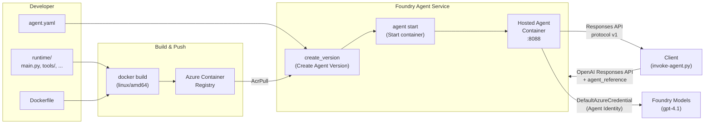

# Hosted Agent

[English](./README.md) | [日本語](./README.ja.md)

This folder contains the Hosted Agent application that uses Entra Agent ID.

The container image is pushed to Azure Container Registry (ACR) and deployed as a Hosted Agent on Foundry Agent Service.

## Architecture

### Overall Structure



### Deployment Lifecycle

Hosted Agent deployment consists of the following 4 phases:

| Phase      | Actions                                                                                                                                                                                                | Execution method                            |
| ---------- | ------------------------------------------------------------------------------------------------------------------------------------------------------------------------------------------------------ | ------------------------------------------- |
| **build**  | Build container image with `docker build --platform linux/amd64`                                                                                                                                       | `deploy-agent.py` / Docker                  |
| **push**   | `az acr login` → `docker push` to push image to ACR                                                                                                                                                    | `deploy-agent.py` / Docker + Azure CLI      |
| **deploy** | `AIProjectClient.agents.create_version()` to create an Agent Version. The definition in `agent.yaml` (image URI, CPU/memory, environment variables, protocol) is registered with Foundry Agent Service | `deploy-agent.py` / `azure-ai-projects` SDK |
| **start**  | `az cognitiveservices agent start` causes Foundry Agent Service to start the container and make it routable via the Responses API                                                                      | Azure CLI / Foundry Agent Service           |

> **Agent Version idempotency**: The `create_version` API is idempotent. If the definition (image URI, environment variables, etc.) is identical to the previous version, no new version is created and the existing version is returned.
> `deploy-agent.py` detects this behavior and, when an existing version is returned, performs `delete-deployment` → `start` to swap the container image.

```text
create_version
  ├─ New version ──────────────────────→ start → (polling with --wait)
  └─ Existing version → delete-deployment → start → (polling with --wait)
```

### Communication Protocol

The `container_protocol_versions` field in `agent.yaml` specifies the **Responses API protocol (v1)**.
This is the current Microsoft Foundry standard protocol, replacing the legacy Assistants API (Agents v0.5/v1).

| Aspect                     | Responses API (Agents v2) — this sample         | Assistants API (Agents v0.5/v1) — legacy  |
| -------------------------- | ----------------------------------------------- | ----------------------------------------- |
| API style                  | Stateless — 1 request = 1 response              | Stateful — manages Thread / Run / Message |
| Client SDK                 | `openai_client.responses.create()`              | `openai_client.beta.assistants` + threads |
| Hosted Agent specification | `extra_body={"agent_reference": {"name": ...}}` | N/A (Hosted Agent not supported)          |
| `agent.yaml` setting       | `protocol: responses`, `version: v1`            | `protocol: assistants`, `version: v1`     |
| State management           | Client manages conversation history             | Server accumulates in Thread              |

- **Client → Foundry Agent Service**: OpenAI Responses API (`openai_client.responses.create()`) + `agent_reference` to specify the Hosted Agent
- **Foundry Agent Service → Container**: Forwarded to port 8088 via Responses API protocol v1
- **Inside container**: `from_agent_framework(agent).run()` receives requests as the hosting adapter

### File Structure

```text
agent.yaml                … Agent definition (name, image, environment variables)
runtime/
  main.py                 … Entry point — configures the Agent with Agent Framework and starts the hosting adapter
  config.py               … Environment variable loading & validation
  tools/debug.py          … Debug tool (returns runtime environment info)
  tools/token_exchange.py … Entra Agent ID token acquisition tool (T1 token acquisition)
  Dockerfile              … linux/amd64 container image definition
  requirements.txt        … Python dependencies
entra-agent-id/
  set-blueprint-fic.py    … Register/delete FIC (Federated Identity Credential) on Blueprint (via Graph API)
scripts/
  deploy-agent.py         … Executes build → ACR push → agent version creation → deploy in one step
  invoke-agent.py         … Invokes the deployed agent via OpenAI Responses API
```

### SDKs Used

| Package                               | Purpose                                                                                                                 |
| ------------------------------------- | ----------------------------------------------------------------------------------------------------------------------- |
| `azure-ai-agentserver-agentframework` | Hosted Agent framework (Agent, tool, hosting adapter)                                                                   |
| `azure-identity`                      | Authentication via DefaultAzureCredential                                                                               |
| `httpx`                               | HTTP client (token exchange, etc.)                                                                                      |
| `azure-ai-projects`                   | AIProjectClient — agent management & OpenAI client retrieval (scripts only; not included in runtime `requirements.txt`) |
| `msal`                                | Graph API interactive authentication — used in FIC registration script (`set-blueprint-fic.py`)                         |

## Prerequisites

### 1. Infrastructure Deployment

This sample requires the following Azure resources to be provisioned in advance:

- Microsoft Foundry resource + Project
- Azure Container Registry (ACR)
- Model deployment (e.g., `gpt-4.1`)
- Application Insights (optional)

See sections 2–4 of [Getting Started](../../docs/getting-started.md) for infrastructure deployment instructions.
Terraform templates are in [`src/infra/`](../infra/).

### 2. Verify `.env` File

When `sync-infra-env.py` completes successfully, the following variables are written to `src/.env`:

| Variable                                   | Description                            |
| ------------------------------------------ | -------------------------------------- |
| `AZURE_RESOURCE_GROUP`                     | Resource group name                    |
| `AZURE_SUBSCRIPTION_ID`                    | Subscription ID                        |
| `AZURE_LOCATION`                           | Region                                 |
| `FOUNDRY_PROJECT_ENDPOINT`                 | Foundry Project endpoint               |
| `FOUNDRY_MODEL_DEPLOYMENT_NAME`            | Model deployment name                  |
| `FOUNDRY_AGENT_ACR_LOGIN_SERVER`           | ACR login server                       |
| `AZURE_CONTAINER_REGISTRY_NAME`            | ACR name                               |
| `ENTRA_TENANT_ID`                          | Entra ID tenant ID                     |
| `ENTRA_AGENT_BLUEPRINT_IDENTITY_CLIENT_ID` | Entra Agent ID Blueprint client ID     |
| `ENTRA_AGENT_IDENTITY_CLIENT_ID`           | Entra Agent Identity client ID         |
| `RESOURCE_API_URL`                         | Identity Echo API URL                  |
| `ENTRA_RESOURCE_API_CLIENT_ID`             | Resource API client ID                 |
| `ENTRA_RESOURCE_API_SCOPE`                 | Resource API scope                     |
| `ENTRA_RESOURCE_API_DEFAULT_SCOPE`         | Resource API default scope             |
| `APPLICATIONINSIGHTS_CONNECTION_STRING`    | Application Insights connection string |

> **To generate `.env` manually:**
>
> ```bash
> python src/scripts/sync-infra-env.py
> ```

### 3. Azure CLI Login

```bash
az login --tenant <your-tenant-id>
```

### 4. FIC (Federated Identity Credential) Registration

To **acquire a token (T1) acting as an Entra Agent ID (Agent Identity)** from code running inside the Hosted Agent,
you must manually register a **Federated Identity Credential (FIC)** on the Agent Identity Blueprint.

#### Why is manual FIC registration required?

Foundry auto-provisions one FIC when creating the Blueprint, but the subject of this default FIC is an internal Azure ML FMI path.
**It does not match the token obtained by `DefaultAzureCredential()` from the Project MI inside the Hosted Agent container.**

| FIC                                    | Subject                                              | Purpose                                                     |
| -------------------------------------- | ---------------------------------------------------- | ----------------------------------------------------------- |
| **Foundry auto-provisioned (default)** | `/eid1/c/pub/t/{tenantId}/a/{AML_AppID}/AzureAI/FMI` | Internal Agent Service infrastructure (MCP tool auth, etc.) |
| **Manually registered (this step)**    | `{Project MI Object ID}`                             | Hosted Agent code → T1 token acquisition                    |

In other words, for user code inside the Hosted Agent to acquire T1 via Token Exchange,
**a FIC with the Project MI's Object ID as the subject must be added to the Blueprint**.
Without this, Step 2 of the Token Exchange (`client_credentials` + `client_assertion`) will fail with
`AADSTS700223: No matching federated identity record found for presented assertion subject`.

#### Token Exchange Mechanism (T1 Acquisition)

```text
┌──────────────────────┐     Step 1: MI token           ┌─────────────────────┐
│  Hosted Agent        │ ─────────────────────────────→ │  Entra ID           │
│  (code in container) │  DefaultAzureCredential()      │  Token Endpoint     │
│                      │  scope: api://AzureADToken     │                     │
│                      │         Exchange/.default      │                     │
│                      │                                │                     │
│                      │     Step 2: Token Exchange     │                     │
│                      │ ─────────────────────────────→ │                     │
│                      │  client_id: Blueprint App ID   │                     │
│                      │  client_assertion: MI token    │                     │
│                      │  fmi_path: Agent Identity ID   │                     │
│                      │                                │                     │
│                      │ ←───────────────── T1 token ── │                     │
└──────────────────────┘                                └─────────────────────┘

  Because the FIC is registered with subject = Project MI's OID,
  the client_assertion (MI token) in Step 2 is accepted as a valid credential for the Blueprint.
```

#### Registration Steps

Use `set-blueprint-fic.py` to register the FIC (idempotent: skips if the FIC already exists).

**Prerequisites:**

- The following variables must be set in `.env`:
  - `ENTRA_TENANT_ID` — Tenant ID
  - `ENTRA_AGENT_BLUEPRINT_IDENTITY_CLIENT_ID` — Blueprint Application (Client) ID
  - `FOUNDRY_PROJECT_MSI` — Foundry Project Managed Identity Object ID
  - `GRAPH_API_OPS_CLIENT_ID` — Client ID for Graph API operations app (deployed via Terraform in [`entra_id/prereqs/`](../entra_id/prereqs/))
- The executing user must have Graph API permissions such as `AgentIdentityBlueprint.AddRemoveCreds.All`

**Execution:**

```bash
# Run from the repository root
python src/agent/entra-agent-id/set-blueprint-fic.py
```

A browser will open for interactive login requesting Graph API access permissions.
After authentication, the following output indicates successful registration:

```text
Login with browser...
Created FIC 'foundry-project-fmi-fic' (id: xxxxxxxx-xxxx-xxxx-xxxx-xxxxxxxxxxxx)
  issuer:  https://login.microsoftonline.com/{tenantId}/v2.0
  subject: {Project MI Object ID}
```

> **If already registered:**
>
> ```text
> FIC 'foundry-project-fmi-fic' already exists (id: ...). Skipping.
> ```

**Deleting the FIC (if needed):**

```bash
python src/agent/entra-agent-id/set-blueprint-fic.py delete
```

> **Important**: If the FIC is not registered and you invoke the agent, the T1 acquisition step in `tools/token_exchange.py` will fail with
> `AADSTS700223` error, and resource API access as the Agent Identity will fail.
> Be sure to complete this step before deploying and starting the agent.

## Usage

### Building & Deploying the Agent

`deploy-agent.py` handles everything from build to deployment in one step.

```bash
cd src/agent

# Execute all phases (build → push → deploy)
python ./scripts/deploy-agent.py

# Start the agent after deployment
python ./scripts/deploy-agent.py --start

# Wait until Ready after starting (--wait implicitly includes --start)
python ./scripts/deploy-agent.py --wait

# Specify wait timeout (default: 1020 seconds = 15 min + 2 min margin)
python ./scripts/deploy-agent.py --wait --wait-timeout 600
```

You can also execute individual phases:

```bash
# Build container image only
python ./scripts/deploy-agent.py build

# Push to ACR only
python ./scripts/deploy-agent.py push

# Create agent version only
python ./scripts/deploy-agent.py deploy

# Build + push only (skip deploy)
python ./scripts/deploy-agent.py build push

# Build → push → deploy → start → wait for Ready
python ./scripts/deploy-agent.py build push deploy --wait
```

### Agent Management via Azure CLI

`deploy-agent.py` creates versions via the SDK, but starting, stopping, and checking status is done with Azure CLI.
All commands below use the `az cognitiveservices agent` subcommand.

Common parameters:

```bash
# Obtained from .env values or Terraform outputs
ACCOUNT_NAME="<foundry_account_name>"     # Foundry resource name
PROJECT_NAME="<project_name>"             # Foundry Project name
AGENT_NAME="<agent_name>"                 # name field in agent.yaml
AGENT_VERSION="<agent_version>"           # Version returned by create_version
```

#### Starting the Agent

To start manually without using `deploy-agent.py --start`:

```bash
az cognitiveservices agent start \
    --account-name "$ACCOUNT_NAME" \
    --project-name "$PROJECT_NAME" \
    --name "$AGENT_NAME" \
    --agent-version "$AGENT_VERSION"
```

#### Checking Status

Verify that the agent is correctly deployed and running after deployment.

```bash
az cognitiveservices agent status \
    --account-name "$ACCOUNT_NAME" \
    --project-name "$PROJECT_NAME" \
    --name "$AGENT_NAME" \
    --agent-version "$AGENT_VERSION"
```

Key status values:

| Field                          | Value               | Description                          |
| ------------------------------ | ------------------- | ------------------------------------ |
| `status`                       | `Running`           | Running normally                     |
| `status`                       | `Failed`            | Start failed. Check the logs         |
| `status`                       | `Stopped`           | Stopped                              |
| `status`                       | `Deleted`           | Deployment deleted                   |
| `container.provisioning_state` | `Succeeded`         | Container provisioning complete      |
| `container.health_state`       | `Healthy`           | Health check passed                  |
| `container.state`              | `RunningAtMaxScale` | Container running (at replica limit) |

`deploy-agent.py --wait` determines Ready when all of the following are met:

- `status` == `Running`
- `container.provisioning_state` == `Succeeded`
- `container.health_state` == `Healthy`
- `container.state` starts with `Running` (e.g., `RunningAtMaxScale`)

#### Stopping the Agent

```bash
az cognitiveservices agent stop \
    --account-name "$ACCOUNT_NAME" \
    --project-name "$PROJECT_NAME" \
    --name "$AGENT_NAME" \
    --agent-version "$AGENT_VERSION"
```

#### Listing Agents

```bash
az cognitiveservices agent list \
    --account-name "$ACCOUNT_NAME" \
    --project-name "$PROJECT_NAME"
```

#### Viewing Logs

Check container logs when startup fails or for debugging:

```bash
az cognitiveservices agent logs \
    --account-name "$ACCOUNT_NAME" \
    --project-name "$PROJECT_NAME" \
    --name "$AGENT_NAME" \
    --agent-version "$AGENT_VERSION"
```

> **Tip**: `main.py` outputs logs with a `[BOOT]` prefix during the startup phase. When startup fails, use these logs to identify at which stage initialization failed.

### Invoking the Agent

Send a message to a deployed and running agent.

```bash
cd src/agent

# Invoke with default message
python scripts/invoke-agent.py

# Invoke with a custom message
python scripts/invoke-agent.py "Get runtime environment info and tell me the authentication state and environment variables"
```

## `agent.yaml` Configuration

`agent.yaml` defines the Hosted Agent's name, container image, environment variables, etc.,
and is referenced by the agent deployment script.

```yaml
name: demo-entraagtid-agent
definition:
  container_protocol_versions:
    - protocol: responses
      version: v1
  cpu: "1"
  memory: 2Gi
  image: ${FOUNDRY_AGENT_ACR_LOGIN_SERVER}/demo-agent:latest
  environment_variables:
    FOUNDRY_PROJECT_ENDPOINT: ${FOUNDRY_PROJECT_ENDPOINT}
    FOUNDRY_MODEL_DEPLOYMENT_NAME: ${FOUNDRY_MODEL_DEPLOYMENT_NAME}
    RESOURCE_API_URL: ${RESOURCE_API_URL}
    ENTRA_TENANT_ID: ${ENTRA_TENANT_ID}
    ENTRA_AGENT_BLUEPRINT_IDENTITY_CLIENT_ID: ${ENTRA_AGENT_BLUEPRINT_IDENTITY_CLIENT_ID}
    ENTRA_AGENT_IDENTITY_CLIENT_ID: ${ENTRA_AGENT_IDENTITY_CLIENT_ID}
    ENTRA_RESOURCE_API_CLIENT_ID: ${ENTRA_RESOURCE_API_CLIENT_ID}
    ENTRA_RESOURCE_API_SCOPE: ${ENTRA_RESOURCE_API_SCOPE}
    ENTRA_RESOURCE_API_DEFAULT_SCOPE: ${ENTRA_RESOURCE_API_DEFAULT_SCOPE}
```

- `${VAR}` placeholders are automatically expanded by `deploy-agent.py` using values from `.env`
- Specifying `responses` / `v1` in `container_protocol_versions` enables the Responses API protocol
