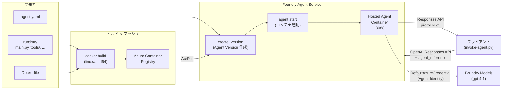

# Hosted Agent

このフォルダは、Entra Agent ID を使った Hosted Agent のアプリケーションです。

コンテナイメージを Azure Container Registry (ACR) にプッシュし、
Foundry Agent Service に Hosted Agent としてデプロイして利用します。

## アーキテクチャ

### 全体構成



### デプロイライフサイクル

Hosted Agent のデプロイは以下の 4 フェーズで構成されます:

| フェーズ   | 実行内容                                                                                                                                                                      | 実行の方法                                  |
| ---------- | ----------------------------------------------------------------------------------------------------------------------------------------------------------------------------- | ------------------------------------------- |
| **build**  | `docker build --platform linux/amd64` でコンテナイメージをビルド                                                                                                              | `deploy-agent.py` / Docker                  |
| **push**   | `az acr login` → `docker push` で ACR にイメージをプッシュ                                                                                                                    | `deploy-agent.py` / Docker + Azure CLI      |
| **deploy** | `AIProjectClient.agents.create_version()` で Agent Version を作成。`agent.yaml` の定義（イメージ URI、CPU/メモリ、環境変数、プロトコル）が Foundry Agent Service に登録される | `deploy-agent.py` / `azure-ai-projects` SDK |
| **start**  | `az cognitiveservices agent start` で Foundry Agent Service がコンテナを起動し、Responses API 経由でルーティング可能にする                                                    | Azure CLI / Foundry Agent Service           |

> **Agent Version**: 各デプロイは一意のバージョンとして管理されます。同一エージェント名で複数のバージョンを作成し、切り替えることが可能です。

### 通信プロトコル

`agent.yaml` の `container_protocol_versions` で **Responses API プロトコル (v1)** を指定しています。
これは旧 Assistants API (Agents v0.5/v1) に代わる現行の Microsoft Foundry 標準プロトコルです。

| 観点                  | Responses API (Agents v2) — 本サンプル          | Assistants API (Agents v0.5/v1) — 旧方式     |
| --------------------- | ----------------------------------------------- | -------------------------------------------- |
| API スタイル          | ステートレス — 1 リクエスト = 1 レスポンス      | ステートフル — Thread / Run / Message を管理 |
| クライアント SDK      | `openai_client.responses.create()`              | `openai_client.beta.assistants` + threads    |
| Hosted Agent 指定方法 | `extra_body={"agent_reference": {"name": ...}}` | N/A（Hosted Agent 非対応）                   |
| `agent.yaml` 設定     | `protocol: responses`, `version: v1`            | `protocol: assistants`, `version: v1`        |
| 状態管理              | クライアント側で会話履歴を管理                  | サーバー側で Thread に蓄積                   |

- **クライアント → Foundry Agent Service**: OpenAI Responses API (`openai_client.responses.create()`) + `agent_reference` で Hosted Agent を指定
- **Foundry Agent Service → コンテナ**: Responses API プロトコル v1 でポート 8088 に転送
- **コンテナ内**: `from_agent_framework(agent).run()` がホスティングアダプタとしてリクエストを受信

### ファイル構成

```text
agent.yaml                … エージェント定義 (名前・イメージ・環境変数)
runtime/
  main.py                 … エントリポイント — Agent Framework で Agent を構成し、ホスティングアダプタを起動
  config.py               … 環境変数の読み込み・バリデーション
  tools/debug.py          … デバッグ用ツール (ランタイム環境情報を返す)
  tools/token_exchange.py … Entra Agent ID トークン取得ツール (T1 token acquisition)
  Dockerfile              … linux/amd64 コンテナイメージ定義
  requirements.txt        … Python 依存パッケージ
scripts/
  deploy-agent.py         … ビルド → ACR プッシュ → エージェントバージョン作成 -> デプロイを一括で実行
  invoke-agent.py         … デプロイ済みエージェントを OpenAI Responses API 経由で呼び出す
```

### 使用 SDK

| パッケージ                            | 用途                                                                                                                             |
| ------------------------------------- | -------------------------------------------------------------------------------------------------------------------------------- |
| `azure-ai-agentserver-agentframework` | Hosted Agent フレームワーク (Agent, tool, ホスティングアダプタ)                                                                  |
| `azure-identity`                      | DefaultAzureCredential による認証                                                                                                |
| `httpx`                               | HTTP クライアント (トークン交換等)                                                                                               |
| `azure-ai-projects`                   | AIProjectClient — エージェント管理・OpenAI クライアント取得 (※ スクリプト側のみ。ランタイムの `requirements.txt` には含まれない) |

## 事前準備

### 1. インフラストラクチャのデプロイ

このサンプルは、以下の Azure リソースが事前にプロビジョニングされている必要があります。
リポジトリルートの [`infra/`](../infra/) ディレクトリに Terraform テンプレートが用意されています。

**必要なリソース:**

- Microsoft Foundry resource + Project
- Azure Container Registry (ACR)
- モデルデプロイメント (例: `gpt-4.1`)
- Application Insights (オプション)

**デプロイ手順:**

```bash
# リポジトリルートに移動
cd /path/to/microsoft-entra-agent-id
#（Dev Container 利用時はすでにルート `/workspaces/microsoft-entra-agent-id` にいる状態）

# リソースグループ名を設定
export AZURE_RESOURCE_GROUP="rg-your-resource-group"

# インフラをデプロイ (.env の自動生成を含む)
bash ./scripts/deploy.sh
```

`deploy.sh` は以下を自動的に行います:

1. Terraform テンプレートで Azure リソースをデプロイ
2. デプロイ出力から `.env` ファイルを自動生成 (`scripts/sync-infra-env.py`)

### 2. `.env` ファイルの確認

`deploy.sh` が正常に完了すると、`app/.env` に以下の変数が書き出されます:

| 変数名                                     | 説明                                       |
| ------------------------------------------ | ------------------------------------------ |
| `AZURE_RESOURCE_GROUP`                     | リソースグループ名                         |
| `AZURE_SUBSCRIPTION_ID`                    | サブスクリプション ID                      |
| `AZURE_LOCATION`                           | リージョン                                 |
| `FOUNDRY_PROJECT_ENDPOINT`                 | Foundry Project エンドポイント             |
| `FOUNDRY_MODEL_DEPLOYMENT_NAME`            | モデルデプロイメント名                     |
| `FOUNDRY_AGENT_ACR_LOGIN_SERVER`           | ACR ログインサーバー                       |
| `AZURE_CONTAINER_REGISTRY_NAME`            | ACR 名                                     |
| `ENTRA_TENANT_ID`                          | Entra ID テナント ID                       |
| `ENTRA_AGENT_BLUEPRINT_IDENTITY_CLIENT_ID` | Entra Agent ID Blueprint のクライアント ID |
| `ENTRA_AGENT_IDENTITY_CLIENT_ID`           | Entra Agent Identity のクライアント ID     |
| `RESOURCE_API_URL`                         | Identity Echo API の URL                   |
| `ENTRA_RESOURCE_API_CLIENT_ID`             | リソース API のクライアント ID             |
| `ENTRA_RESOURCE_API_SCOPE`                 | リソース API のスコープ                    |
| `ENTRA_RESOURCE_API_DEFAULT_SCOPE`         | リソース API のデフォルトスコープ          |
| `APPLICATIONINSIGHTS_CONNECTION_STRING`    | Application Insights 接続文字列            |

> **手動で `.env` を生成する場合:**
> デプロイ出力の JSON を `generate_env.py` にパイプできます。
>
> ```bash
> az deployment group show \
>   --resource-group "$AZURE_RESOURCE_GROUP" \
>   --name "<deployment-name>" \
>   --output json \
> | python3 scripts/generate_env.py \
>     --env-file app/.env \
>     --extra \
>       "AZURE_RESOURCE_GROUP=$AZURE_RESOURCE_GROUP" \
>       "AZURE_SUBSCRIPTION_ID=$(az account show --query id -o tsv)"
> ```

### 3. Azure CLI ログイン

```bash
az login --tenant <your-tenant-id>
```

## 使い方

### エージェントのビルド・デプロイ

`deploy-agent.py` がビルドからデプロイまでを一括で行います。

```bash
cd app/samples/simple-hosted-agent

# 全フェーズ実行 (build → push → deploy)
python ./scripts/deploy-agent.py

# デプロイ後にエージェントを起動する場合
python ./scripts/deploy-agent.py --start
```

個別のフェーズのみ実行することもできます:

```bash
# コンテナイメージのビルドのみ
python ./scripts/deploy-agent.py build

# ACR へのプッシュのみ
python ./scripts/deploy-agent.py push

# エージェントバージョンの作成のみ
python ./scripts/deploy-agent.py deploy

# ビルド + プッシュのみ (デプロイはスキップ)
python ./scripts/deploy-agent.py build push
```

### Azure CLI によるエージェント管理

`deploy-agent.py` は SDK 経由でバージョン作成を行いますが、起動・停止・状態確認は Azure CLI で操作します。
以下のコマンドは全て `az cognitiveservices agent` サブコマンドで実行できます。

共通パラメータ:

```bash
# .env の値や Terraform の出力から取得
ACCOUNT_NAME="<foundry_account_name>"     # Foundry resource 名
PROJECT_NAME="<project_name>"             # Foundry Project 名
AGENT_NAME="<agent_name>"                 # agent.yaml の name フィールド
AGENT_VERSION="<agent_version>"           # create_version で返されるバージョン
```

#### エージェントの起動

`deploy-agent.py --start` を使わずに手動で起動する場合:

```bash
az cognitiveservices agent start \
    --account-name "$ACCOUNT_NAME" \
    --project-name "$PROJECT_NAME" \
    --name "$AGENT_NAME" \
    --agent-version "$AGENT_VERSION"
```

#### 状態の確認

デプロイ後にエージェントが正しく展開され、起動していることを確認します。

```bash
az cognitiveservices agent status \
    --account-name "$ACCOUNT_NAME" \
    --project-name "$PROJECT_NAME" \
    --name "$AGENT_NAME" \
    --agent-version "$AGENT_VERSION"
```

主なステータス:

| ステータス     | 説明                                           |
| -------------- | ---------------------------------------------- |
| `Provisioning` | コンテナの起動中                               |
| `Running`      | 正常稼働中。Responses API でリクエスト受付可能 |
| `Failed`       | 起動失敗。ログを確認してください               |
| `Stopped`      | 停止済み                                       |

#### エージェントの停止

```bash
az cognitiveservices agent stop \
    --account-name "$ACCOUNT_NAME" \
    --project-name "$PROJECT_NAME" \
    --name "$AGENT_NAME" \
    --agent-version "$AGENT_VERSION"
```

#### エージェント一覧の取得

```bash
az cognitiveservices agent list \
    --account-name "$ACCOUNT_NAME" \
    --project-name "$PROJECT_NAME"
```

#### ログの確認

起動失敗時やデバッグ時にコンテナログを確認します:

```bash
az cognitiveservices agent logs \
    --account-name "$ACCOUNT_NAME" \
    --project-name "$PROJECT_NAME" \
    --name "$AGENT_NAME" \
    --agent-version "$AGENT_VERSION"
```

> **Tip**: `main.py` は起動フェーズで `[BOOT]` プレフィックス付きのログを出力します。起動失敗時はこのログで初期化のどの段階で失敗したかを特定できます。

### エージェントの呼び出し

デプロイ・起動済みのエージェントに対してメッセージを送信します。

```bash
cd app/samples/simple-hosted-agent

# デフォルトメッセージで呼び出し
python scripts/invoke-agent.py

# カスタムメッセージで呼び出し
python scripts/invoke-agent.py "ランタイム環境の情報を取得して、認証状態と環境変数を教えてください"
```

## `agent.yaml` の構成

`agent.yaml` では、Hosted Agent の名前、使用するコンテナイメージ、環境変数などを定義し、
エージェントのデプロイ スクリプトから参照されます。

```yaml
name: demo-entraagtid-agent
definition:
  container_protocol_versions:
    - protocol: responses
      version: v1
  cpu: "1"
  memory: 2Gi
  image: ${FOUNDRY_AGENT_ACR_LOGIN_SERVER}/demo-agent:latest
  environment_variables:
    FOUNDRY_PROJECT_ENDPOINT: ${FOUNDRY_PROJECT_ENDPOINT}
    FOUNDRY_MODEL_DEPLOYMENT_NAME: ${FOUNDRY_MODEL_DEPLOYMENT_NAME}
    RESOURCE_API_URL: ${RESOURCE_API_URL}
    ENTRA_TENANT_ID: ${ENTRA_TENANT_ID}
    ENTRA_AGENT_BLUEPRINT_IDENTITY_CLIENT_ID: ${ENTRA_AGENT_BLUEPRINT_IDENTITY_CLIENT_ID}
    ENTRA_AGENT_IDENTITY_CLIENT_ID: ${ENTRA_AGENT_IDENTITY_CLIENT_ID}
    ENTRA_RESOURCE_API_CLIENT_ID: ${ENTRA_RESOURCE_API_CLIENT_ID}
    ENTRA_RESOURCE_API_SCOPE: ${ENTRA_RESOURCE_API_SCOPE}
    ENTRA_RESOURCE_API_DEFAULT_SCOPE: ${ENTRA_RESOURCE_API_DEFAULT_SCOPE}
```

- `${VAR}` は `deploy-agent.py` が `.env` の値で自動展開します
- `container_protocol_versions` に `responses` / `v1` を指定することで Responses API プロトコルを使用します

## 認証と RBAC

### 認証方式

このサンプルは全て **Microsoft Entra ID (旧 Azure AD)** による認証を使用し、接続文字列やキーは使いません。
コード内では `DefaultAzureCredential` を使い、実行環境に応じて自動的に適切な認証方式が選択されます。

| 実行環境                     | 認証方式                                 | 説明                                                                                       |
| ---------------------------- | ---------------------------------------- | ------------------------------------------------------------------------------------------ |
| **ローカル開発**             | `az login` のトークン                    | Azure CLI でログインしたユーザーの資格情報を使用                                           |
| **Foundry Agent Service 上** | Agent Identity (Managed Identity)        | Foundry Project のシステム割り当てマネージド ID で自動認証。キーやシークレットの管理が不要 |
| **CI/CD**                    | サービスプリンシパル / Workload Identity | `AZURE_CLIENT_ID` / `AZURE_TENANT_ID` 環境変数で設定                                       |

### エンドポイントの使い分け

Foundry Project には 2 つのエンドポイント形式があり、用途に応じて使い分ける必要があります:

| エンドポイント        | 形式                                                                   | 用途                                                                       |
| --------------------- | ---------------------------------------------------------------------- | -------------------------------------------------------------------------- |
| **CognitiveServices** | `https://<account>.cognitiveservices.azure.com/api/projects/<project>` | エージェントバージョン作成 (`deploy-agent.py`)、Terraform 出力のデフォルト |
| **Services**          | `https://<account>.services.ai.azure.com/api/projects/<project>`       | OpenAI クライアント取得・Responses API 呼び出し (`invoke-agent.py`)        |

> **注意**: `invoke-agent.py` は内部で `cognitiveservices.azure.com` → `services.ai.azure.com` への自動変換を行います。`agent_reference` を使った Hosted Agent の呼び出しは `services.ai.azure.com` ドメインでのみ動作します。

### サービス間 RBAC (自動設定)

Terraform テンプレート ([`main.rbac.services.tf`](../infra/main.rbac.services.tf)) が以下のロール割り当てを自動的に構成します:

| 送信元 (Principal) | 送信先 (Scope)  | ロール                                   | 用途                                         |
| ------------------ | --------------- | ---------------------------------------- | -------------------------------------------- |
| Foundry Project MI | Foundry Account | **Cognitive Services User**              | モデル呼び出し (DefaultAzureCredential 経由) |
| Foundry Project MI | ACR             | **AcrPull**                              | Hosted Agent コンテナイメージの Pull         |
| Foundry Project MI | ACR             | **Container Registry Repository Reader** | コンテナレジストリのデータプレーン読み取り   |

### ユーザー RBAC (自動設定)

Terraform テンプレート ([`main.rbac.users.tf`](../infra/main.rbac.users.tf)) が以下のロール割り当てを自動的に構成します:

| 対象                  | スコープ                  | ロール                 | 用途                               |
| --------------------- | ------------------------- | ---------------------- | ---------------------------------- |
| デプロイ実行ユーザー  | Foundry Account + Project | **Azure AI Owner**     | ポータルアクセス、エージェント管理 |
| AI Developer グループ | Foundry Account + Project | **Azure AI Developer** | モデル・エージェントの開発         |
| AI User グループ      | Foundry Account + Project | **Azure AI User**      | エージェントの利用 (読み取り専用)  |

> **ロール定義の一元管理**: 全てのロール名は [`main.rbac.definitions.tf`](../infra/main.rbac.definitions.tf) に集約されています。Terraform は Azure 組み込みロールを名前で参照できるため、Bicep のような GUID 管理は不要です。

## ローカル開発・デバッグ

Foundry Agent Service にデプロイする前に、ローカル環境でエージェントの動作を確認できます。

### Python で直接実行

`main.py` はローカルでそのまま実行可能です。ホスティングアダプタがポート 8088 で起動します:

```bash
cd app/samples/simple-hosted-agent/runtime

# 依存パッケージのインストール
pip install -r requirements.txt

# 環境変数の設定 (.env は親ディレクトリを遡って自動検出されます)
# 事前に az login が完了していること
python main.py
```

起動に成功すると、以下のようなログが出力されます:

```text
[BOOT] main.py starting
[BOOT] Python 3.11.x
[BOOT] cwd=...
[BOOT] config loaded
[BOOT] FOUNDRY_PROJECT_ENDPOINT=https://...
[BOOT] FOUNDRY_MODEL_DEPLOYMENT_NAME=gpt-4.1
[BOOT] Agent imported
[BOOT] AzureAIAgentClient imported
[BOOT] from_agent_framework imported
[BOOT] DefaultAzureCredential imported
[BOOT] tools imported
[BOOT] Creating AzureAIAgentClient...
[BOOT] AzureAIAgentClient created
[BOOT] Creating Agent...
[BOOT] Agent created
[BOOT] Starting hosting adapter on port 8088...
```

### Docker コンテナで実行

Foundry Agent Service と同じコンテナ環境で動作確認する場合:

```bash
cd app/samples/simple-hosted-agent

# イメージをビルド
docker build --platform linux/amd64 \
    -t demo-agent:local \
    -f runtime/Dockerfile \
    runtime/

# コンテナを起動 (環境変数を .env から渡す)
docker run --rm -it \
    --env-file ../../.env \
    -p 8088:8088 \
    demo-agent:local
```

> **注意**: コンテナ内では `DefaultAzureCredential` が Azure CLI トークンを使えないため、ローカル実行時は `AZURE_CLIENT_ID` / `AZURE_CLIENT_SECRET` / `AZURE_TENANT_ID` を環境変数で渡すか、Python での直接実行を推奨します。

## トラブルシューティング

### `.env` 関連

#### `ERROR: Required env var FOUNDRY_PROJECT_ENDPOINT is not set`

**原因**: `.env` ファイルが見つからない、または必須の環境変数が未定義です。

**対処**:

1. `app/.env` が存在するか確認:

   ```bash
   ls -la app/.env
   ```

2. 存在しない場合はインフラデプロイを再実行:

   ```bash
   bash ./scripts/deploy.sh
   ```

3. 手動で `.env` を生成する場合は「事前準備 > 2. `.env` ファイルの確認」を参照

#### `WARNING: No .env file found in any ancestor directory.`

**原因**: `deploy-agent.py` や `invoke-agent.py` が `.env` を見つけられません。`dotenv` の `find_dotenv()` はスクリプトの位置から親ディレクトリを遡って検索しますが、`app/.env` に到達できない場所から実行している可能性があります。

**対処**: `app/samples/simple-hosted-agent/` ディレクトリから実行してください:

```bash
cd app/samples/simple-hosted-agent
python ./scripts/deploy-agent.py
```

### agent.yaml 関連

#### `ERROR: Undefined environment variables in agent.yaml: FOUNDRY_AGENT_ACR_LOGIN_SERVER, ...`

**原因**: `agent.yaml` 内の `${VAR}` プレースホルダに対応する環境変数が `.env` に定義されていません。

**対処**:

1. `.env` に変数が存在するか確認:

   ```bash
   grep "FOUNDRY_AGENT_ACR_LOGIN_SERVER" app/.env
   ```

2. `deploy.sh` の実行でエラーが出ていなかったか確認

3. 手動で値を追加する場合: ACR リソースのログインサーバーを Azure Portal または CLI で取得

   ```bash
   az acr show --name <acr-name> --query loginServer -o tsv
   ```

### ビルド・プッシュ関連

#### Docker ビルドが `linux/amd64` で失敗する

**原因**: Apple Silicon (ARM) 環境でのクロスコンパイルや、Docker Desktop の設定問題です。

**対処**:

- Docker Desktop で「Use Rosetta for x86_64/amd64 emulation on Apple Silicon」が有効か確認
- Dev Container 内でのビルドを推奨（常に `linux/amd64` 環境）

#### `az acr login` が失敗する

**原因**: Azure CLI のログインが切れている、またはACR へのアクセス権がない可能性があります。

**対処**:

1. Azure CLI のログイン状態を確認:

   ```bash
   az account show
   ```

2. ログインが切れている場合:

   ```bash
   az login --tenant <your-tenant-id>
   ```

3. ACR へのアクセス権を確認（`AcrPush` ロールが必要）:

   ```bash
   az role assignment list \
       --scope /subscriptions/<sub-id>/resourceGroups/<rg>/providers/Microsoft.ContainerRegistry/registries/<acr-name> \
       --query "[].{role:roleDefinitionName, principal:principalName}" \
       -o table
   ```

### デプロイ関連

#### `ERROR: Cannot parse PROJECT_ENDPOINT: ...`

**原因**: `FOUNDRY_PROJECT_ENDPOINT` の形式が想定と異なります。`deploy-agent.py` は以下の形式を期待します:

```text
https://<account>.cognitiveservices.azure.com/api/projects/<project>
```

**対処**: `.env` のエンドポイント値を確認し、上記の形式に合っているか確認してください。`services.ai.azure.com` ドメインのエンドポイントは `deploy-agent.py` では使用できません（`invoke-agent.py` 側で自動変換されます）。

#### deploy フェーズで認証エラー (`AuthenticationError` / `403 Forbidden`)

**原因**: 実行ユーザーに Foundry Project への適切なロールが割り当てられていません。

**対処**:

1. RBAC ロール割り当てを確認:

   ```bash
   az role assignment list \
       --scope /subscriptions/<sub-id>/resourceGroups/<rg>/providers/Microsoft.CognitiveServices/accounts/<account> \
       --query "[].{role:roleDefinitionName, principal:principalName}" \
       -o table
   ```

2. Terraform を再適用すると、`main.rbac.users.tf` によりデプロイユーザーに **Azure AI Owner** が自動割り当てされます

### コンテナ起動関連

#### ステータスが `Failed` のまま

**原因**: コンテナが正常に起動できていません。`main.py` の初期化中にエラーが発生した可能性があります。

**対処**:

1. ログを確認:

   ```bash
   az cognitiveservices agent logs \
       --account-name "$ACCOUNT_NAME" \
       --project-name "$PROJECT_NAME" \
       --name "$AGENT_NAME" \
       --agent-version "$AGENT_VERSION"
   ```

2. `[BOOT]` プレフィックスのログで、初期化のどのステップで失敗したかを特定:

   | 最後の `[BOOT]` ログ         | 失敗箇所                                                         |
   | ---------------------------- | ---------------------------------------------------------------- |
   | `main.py starting`           | `config.py` の読み込みに失敗（環境変数未設定の可能性）           |
   | `config loaded`              | `agent_framework` のインポートに失敗（パッケージ未インストール） |
   | `tools imported`             | `AzureAIAgentClient` の作成に失敗（エンドポイント・認証エラー）  |
   | `AzureAIAgentClient created` | `Agent` の構成に失敗（tools の定義エラー）                       |
   | `Agent created`              | ホスティングアダプタの起動に失敗（ポート 8088 の競合等）         |

3. ローカルで同じイメージを実行して再現確認：

   ```bash
   docker run --rm -it \
       -e FOUNDRY_PROJECT_ENDPOINT="$FOUNDRY_PROJECT_ENDPOINT" \
       -e FOUNDRY_MODEL_DEPLOYMENT_NAME="$FOUNDRY_MODEL_DEPLOYMENT_NAME" \
       -p 8088:8088 \
       <image>
   ```

### 呼び出し関連

#### `invoke-agent.py` で `agent_reference` が認識されない

**原因**: `cognitiveservices.azure.com` ドメインのエンドポイントを直接使っている可能性があります。

**対処**: `invoke-agent.py` は自動変換を行いますが、カスタムスクリプトから呼び出す場合は `services.ai.azure.com` ドメインを使ってください:

```python
# NG: cognitiveservices.azure.com では agent_reference が動作しない
endpoint = "https://myaccount.cognitiveservices.azure.com/api/projects/myproject"

# OK: services.ai.azure.com を使用
endpoint = "https://myaccount.services.ai.azure.com/api/projects/myproject"
```

#### レスポンスがタイムアウトする

**原因**: エージェントの起動直後はコンテナの初期化に時間がかかる場合があります。また、`invoke-agent.py` のデフォルトタイムアウトは 180 秒です。

**対処**:

1. エージェントのステータスが `Running` であることを確認:

   ```bash
   az cognitiveservices agent status \
       --account-name "$ACCOUNT_NAME" \
       --project-name "$PROJECT_NAME" \
       --name "$AGENT_NAME" \
       --agent-version "$AGENT_VERSION"
   ```

2. 起動直後の場合は数分待ってから再試行
